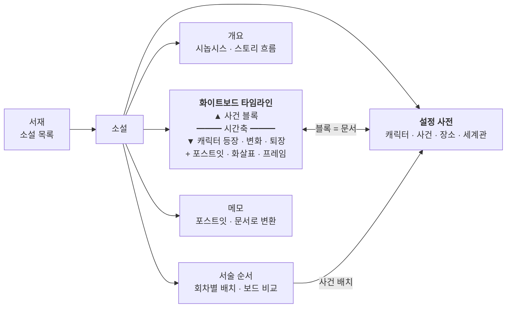

# NovelStory

> 서비스명: **WhiteNoard**
> url: https://whitenoard.tyoujungzz.workers.dev/

웹소설 작가를 위한 스토리 설계 웹 서비스. 화이트보드에 쓰듯 작중 사건, 캐릭터 변화, 설정을 한 화면에서 정리.



## 핵심 기능
- **소설별 관리**: 서재에서 작품 단위로 보드·사전·개요·서술·메모 관리, JSON 백업
- **화이트보드 타임라인**: 무한 캔버스의 시간축 위에 사건 블록, 아래에 캐릭터 등장·변화·퇴장 블록 배치. 포스트잇·도형·화살표·프레임 자유 배치
- **설정 사전**: 캐릭터·사건·장소·세계관 문서, 속성·템플릿·`@` 링크·초성 검색. 보드 블록과 연동, 시점별 캐릭터 상태 보기
- **개요**: 시놉시스 + 보드에서 자동 요약한 스토리 흐름
- **서술 순서 관리**: 작중 시간순과 별개로 회차별 서술 순서 구성, 회상·복선 표시, 보드 위 읽기 경로 비교
- **메모**: 정리 전 아이디어 목록, 포스트잇·사전 문서로 변환
- 데스크톱 전용 (태블릿·모바일은 이후), 데이터는 브라우저 IndexedDB에 자동 저장

## 기술 스택
React + TypeScript + Vite + Tailwind CSS v4 + React Flow + Tiptap + Zustand(zundo) + Dexie, Cloudflare Workers(Static Assets) 무료 티어 배포. 상세: [기술 스택](docs/design/tech_stack.md)

## 개발
```bash
npm install
npm run dev        # 개발 서버 (http://localhost:5173)
npm run lint       # ESLint
npm test           # Vitest (단위)
npm run e2e        # Playwright (브라우저 e2e, 개발 서버 자동 실행)
npm run build      # 타입 검사 + 빌드
```
배포는 main 푸시 시 Cloudflare Workers Builds가 자동 처리

## 문서
- [기능 명세](docs/design/features_spec.md)
- [유스케이스](docs/design/usecase.md)
- [데이터 모델](docs/design/data_model.md)
- [ERD](docs/design/erd.md)
- [단축키](docs/design/shortcuts.md)
- [기술 스택](docs/design/tech_stack.md)
- [UI 가이드](docs/design/ui_guide.md)
- [와이어프레임 (데스크톱)](docs/design/wireframe.md)
- [빈 상태 · 온보딩](docs/design/onboarding.md)
- [기술 스파이크 검증 방법](docs/design/spikes.md)
- [레퍼런스](docs/references.md)
- [할 일](docs/TODO.md)
- [진행 상태](docs/STATUS.md)
