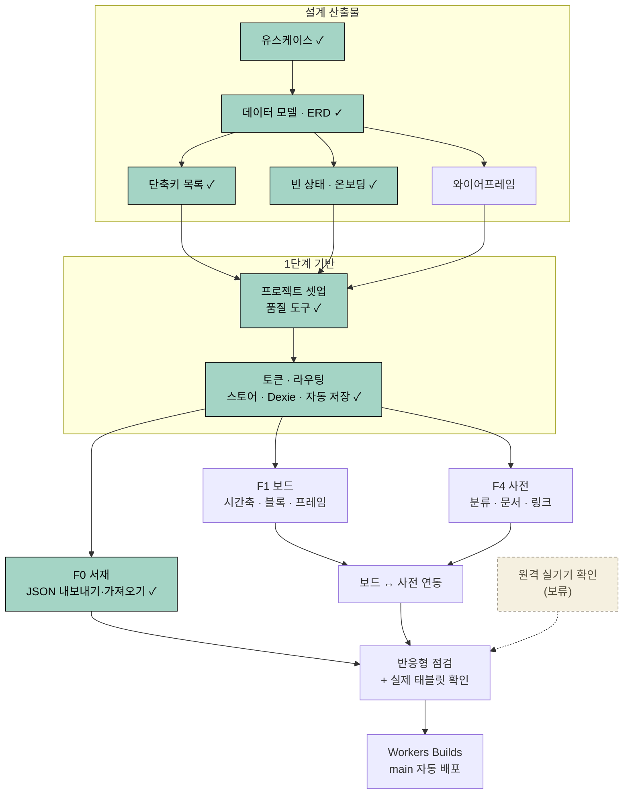

# TODO

남은 작업의 순서·의존 관계 (설계 산출물 → MVP 배포)

## 기획
- [x] 기능 명세 초안 ([features_spec.md](./design/features_spec.md))
- [x] 기술 스택 선정 ([tech_stack.md](./design/tech_stack.md))
- [x] UI 가이드 정리 ([ui_guide.md](./design/ui_guide.md))
- [x] 화이트보드 타임라인·소설별 관리·사전·메모 기획 반영

## 구현 전 결정 (모두 확정)
- [x] A1 작중 시간 모델 → 상대 순서(정수 눈금) + 눈금별 라벨
- [x] A2 시간 공백 처리 → 축 구간 접기(≈ 생략 표시), 눈금 간격은 균등
- [x] A3 시점 불명 사건 → 시간축 왼쪽 "미정 영역"에 배치 허용
- [x] A4 캐릭터 상태 "변화" 구조화 → 사전 속성 변경(키: 이전값→새값) + 자유 메모. 시점별 상태 = 속성 변경 누적
- [x] A5 소설당 보드 개수 → 1개 + 프레임으로 구분
- [x] A6 서술 순서 단위 → 사건 1개를 여러 회차 슬롯에 배치 허용(부분 공개)
- [x] A7 MVP 범위 → F0 서재 + F1 보드 + F4 사전 + F6 로컬 저장. F2·F3·F5·도형·정렬 보조선은 MVP 이후
- [x] A8 모바일 지원 수준 → 보기 + 간단 편집(사전·메모 편집, 보드 이동·확대, 블록 내용 수정), 보드 배치 편집은 태블릿 이상
- [x] A9 로컬 데이터 유실 대책 → `navigator.storage.persist()` + 주기적 JSON 백업 알림. **로그인·유저별 DB(2단계) 도입 전까지** 적용
- [x] A10 서비스명 → WhiteNoard (`whitenoard.<계정>.workers.dev`), 커스텀 도메인은 추후
- [x] A11 다크 모드 → MVP 제외
- [x] B 기술 선택 → Zustand + zundo, Dexie, React Router, Lucide, ESLint + Prettier + Vitest + Playwright, 검색은 부분 일치(초성 검색은 MVP 이후)
- [x] B11 배포 방식 → **GitHub + Cloudflare Workers Builds** (main 푸시 시 자동 배포, 무료 티어)
- 보류: 2단계 인증 방식, 관계도 보기, 이미지 R2 저장, 보드 공동 편집

## 기술 스파이크 (구현 전 소규모 프로토타입)
검증 방법·합격 기준·결과 기록: [spikes.md](./design/spikes.md). 위험도순 정렬.

- [x] 스파이크 앱 준비: `spikes/` 폴더 (`spike` 브랜치), 자동 검증 1차 완료 (2026-09-25)
- [x] PC 실제 한글 입력기 확인 (C1·C2, 2026-09-25)
- [x] C1 한글 IME: 채택 (Tiptap 유지)
- [x] C2 보드 단축키 × IME: 채택 (자동·PC 실제 IME 통과)
- [x] C3 React Flow 성능: 대안 적용 (화면 밖 렌더 생략 기본 on + 축소 시 간략 표시)
- [x] C4 시간축: 채택 (`ViewportPortal` 유지)
- [x] C5 터치: 채택, 실기기 확인 전까지 위험 수용
- [x] C6 캔버스 인라인 편집: 채택 (`nodrag nowheel nopan`)
- [x] C7 프레임: 채택 (중첩 금지, 삭제 시 자식 유지)
- [x] C8 IndexedDB 용량: 대안 적용 (업로드 시 1600px WebP 리사이즈를 Web Worker에서 처리)

### 원격 실기기 확인 (보류 — 설계·구현과 병행 가능, MVP 배포 전까지)
- [ ] 스파이크 앱 배포: 별도 Worker `whitenoard-spike`
- [ ] 원격 테스트 준비: Samsung Developer 계정(Remote Test Lab), Android Studio 에뮬레이터, iOS 체험 서비스(BrowserStack / LambdaTest)
- [ ] C1 삼성 키보드 · iOS Safari 한글 입력·`@` 멘션
- [ ] C3 Galaxy A 실측 → 권장 요소 수 상한 결정
- [ ] C5 실제 태블릿 1회 확인 (**MVP 배포 전 필수**)

## 설계 산출물 (구현 직전)
- [x] 유스케이스 ([usecase.md](./design/usecase.md))
- [x] 데이터 모델 확정본 ([data_model.md](./design/data_model.md)) — 9장 "기본값으로 정한 사항" 검토 필요
- [x] ERD 다이어그램 ([erd.md](./design/erd.md))
- 와이어프레임 (서재 / 보드 / 사전) ([wireframe.md](./design/wireframe.md))
  - [x] 데스크톱 (2026-09-25) — 6장 "기본값으로 정한 사항" 검토 필요
  - [ ] 태블릿 · 모바일
- [x] 단축키 목록 ([shortcuts.md](./design/shortcuts.md)) — 6장 "기본값으로 정한 사항" 검토 필요
- [x] 빈 상태·온보딩 ([onboarding.md](./design/onboarding.md)) — 샘플 소설 제공(가져오기 재사용) + 빈 보드 안내 카드, L-2 갱신 · B-9 · W-7 추가 (2026-09-26). 5장 "기본값으로 정한 사항" 검토 필요

## 1단계 (MVP)
### 기반
- [x] GitHub 원격 저장소 생성·연결 (`kty2001/NovelStory`)
- [x] 프로젝트 셋업: Vite + React + TypeScript + Tailwind v4 + Cloudflare Vite 플러그인 (2026-09-26)
- [x] 품질 도구: ESLint + Prettier + Vitest + Playwright (2026-09-26)
- [x] ui_guide 토큰·폰트를 Tailwind `@theme`에 반영 (사전 본문 H1~H3 스타일 포함 — preflight 초기화 대응, C1) (2026-09-26)
- [x] 라우팅 (React Router), 상태 관리 (Zustand + zundo — 편집 1회·드래그 1회 = 1건, 되돌릴 때 현재 노드와 병합, C2) (2026-09-26)
- [x] Dexie 저장 계층 + 자동 저장 + 내보내기 `schemaVersion` ([data_model.md](./design/data_model.md) 6·7장) (2026-09-26)
- [x] 데이터 유실 대책: `navigator.storage.persist()` + 백업 알림 (A9) (2026-09-26) — 요청 함수·배너 완료, 호출·내보내기 버튼은 F0에서 연결

### F0 서재
- [x] 소설 목록·생성·이름 변경·복제·삭제 (2026-09-26) — 표지 업로드(Web Worker WebP 변환), 되돌리기 알림 포함
- [x] 소설 단위 JSON 내보내기 / 가져오기 (2026-09-26) — 서재 카드·작업공간 ⋯ 메뉴·백업 배너
- [x] 빈 서재(L-2) + 샘플 소설 (2026-09-26): `public/samples/sample.whitenoard.json` 작성, 가져오기 경로로 추가, Vitest 가져오기 테스트 ([onboarding.md](./design/onboarding.md) 4장)
- [x] 첫 소설 생성 시 `persist()` 1회 요청 (2026-09-26)

### F1 화이트보드 타임라인
- [ ] React Flow 캔버스 (줌·팬·미니맵·점 격자, `onlyRenderVisibleElements` 기본 on, 줌 0.5 미만 간략 표시 — C3)
- [ ] 시간축: 정수 눈금 + 눈금 라벨 + x ↔ 눈금 변환 + 스냅 (스파이크 `timeAxis.ts` 이식)
- [ ] 시간축 구간 접기 (A2)
- [ ] 미정 영역 (A3)
- [ ] 도구 모음 → 캔버스 드래그 배치 (Pointer Events)
- [ ] 사건 블록 (단일 시점 / 기간 리사이즈)
- [ ] 스토리 라인: 기본 메인·서브·사이드, 블록 메뉴 지정(다중 선택), 배지·테두리, 필터, 라인 편집 (UC-23)
- [ ] 캐릭터 상태 블록 (등장·변화·퇴장, 속성 변경 입력) + "캐릭터별 정렬"
- [ ] 포스트잇 · 텍스트 · 프레임 (프레임 삭제는 자체 처리, `deleteKeyCode={null}` — C7)
- [ ] 연결선 (화살표·라벨·점선)
- [ ] 다중 선택, 복사·붙여넣기, 실행 취소 / 다시 실행
- [ ] 터치 조작 (핀치 줌, 길게 눌러 메뉴), 모바일 편집 제한 (A8)
- [ ] 빈 보드 안내 카드 · 필터로 전부 숨김 알림 (B-9)

### F4 사전
- [ ] 분류 트리 (기본 분류 + 사용자 분류, 계층, 드래그 정렬)
- [ ] 문서 편집: 제목·별칭·속성·태그·스토리 라인(사건)·본문(Tiptap)·대표 이미지 (Web Worker 리사이즈 + 진행 표시 — C8)
- [ ] 템플릿 (분류별 기본 속성)
- [ ] `@` 링크 + 역링크
- [ ] 표 보기, 전체 검색 (부분 일치)
- [ ] 보드 연동: 블록 ↔ 문서 1:1, 문서 → 보드 드래그, 삭제 경고
- [ ] 빈 분류 · 검색 0건 · 빠른 이동 0건 · 빈 역링크 안내 (W-7)

### 배포
- [ ] 반응형 점검 (태블릿 / 모바일)
- [ ] Cloudflare Workers Builds에 GitHub 저장소 연결 → main 자동 배포

## MVP 이후
- [ ] F2 서술 순서: 회차 목록 + 사건 배치(여러 회차 허용), 서술 방식 표시, 보드 위 비교 오버레이
- [ ] F3 캐릭터 상태 조회: 속성 변경 누적으로 시점별 상태 요약
- [ ] F5 메모: 목록·핀 고정, 포스트잇·사전 문서 변환
- [ ] 보드 도형 (사각형·원·마름모)
- [ ] 정렬 보조선 (직접 구현)
- [ ] 스토리 라인 색 지정 (배지·테두리에 색 적용)
- [ ] 사전 초성 검색 (es-hangul)

## 2단계
- [ ] 인증 방식 결정
- [ ] Workers API + D1 스키마 (유저별 데이터)
- [ ] 로컬 ↔ 서버 동기화 (D1 무료 한도 고려한 디바운스 저장)
- [ ] 로그인 도입 후 A9 백업 알림 정책 재검토
- [ ] 이미지 저장소 (R2) 검토
