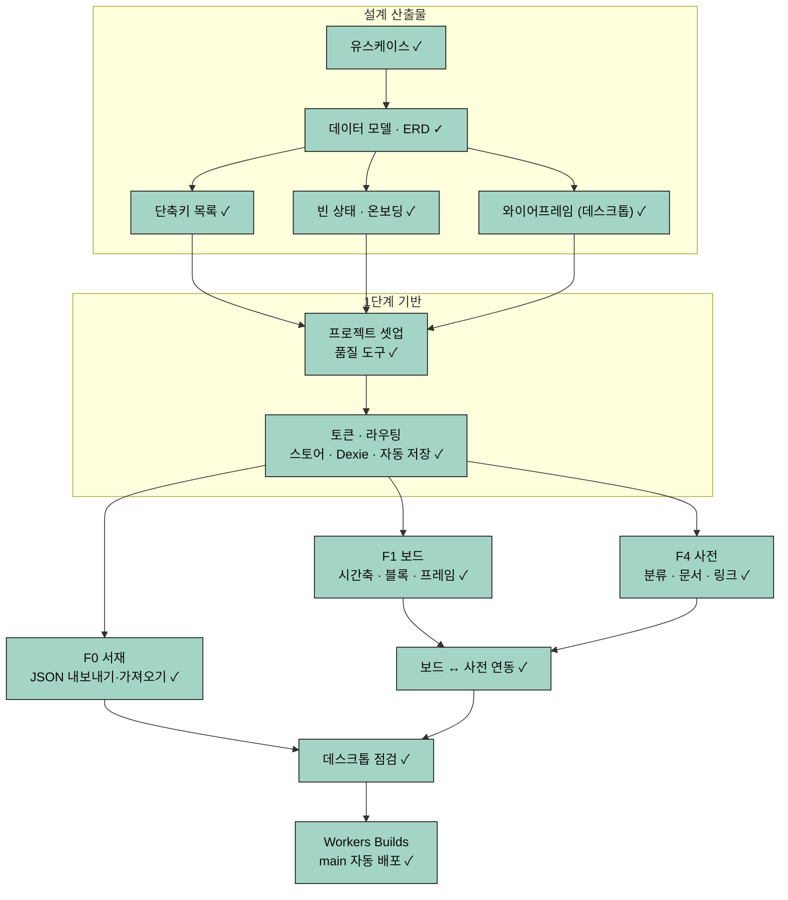

# TODO

남은 작업의 순서·의존 관계 (설계 산출물 → MVP 배포)

```mermaid
%%{init: {"flowchart": {"wrappingWidth": 320}}}%%
flowchart TB
    subgraph DESIGN["설계 산출물"]
        direction LR
        UC["유스케이스 ✓"]:::done --> DM["데이터 모델 · ERD ✓"]:::done
        DM --> SC["단축키 목록 ✓"]:::done
        DM --> ON["빈 상태 · 온보딩 ✓"]:::done
        DM --> WF["와이어프레임 (데스크톱) ✓"]:::done
    end

    subgraph BASE["1단계 기반"]
        direction LR
        SETUP["프로젝트 셋업<br/>품질 도구 ✓"]:::done --> CORE["토큰 · 라우팅<br/>스토어 · Dexie · 자동 저장 ✓"]:::done
    end

    SC --> SETUP
    ON --> SETUP
    WF --> SETUP
    CORE --> F0["F0 서재<br/>JSON 내보내기·가져오기 ✓"]:::done
    CORE --> F1["F1 보드<br/>시간축 · 블록 · 프레임 ✓"]:::done
    CORE --> F4["F4 사전<br/>분류 · 문서 · 링크 ✓"]:::done
    F1 --> LINK["보드 ↔ 사전 연동 ✓"]:::done
    F4 --> LINK
    F0 --> QA["데스크톱 점검 ✓"]:::done
    LINK --> QA
    QA --> DEPLOY["Workers Builds<br/>main 자동 배포 ✓"]:::done

    classDef done fill:#a4d4c5,stroke:#0a0a0a,color:#0a0a0a
```
MVP 완료 · 배포됨 (데스크톱 전용). MVP 이후 기능은 "MVP 이후", 태블릿·모바일은 "MVP 이후 > 태블릿 · 모바일"

## 기획
- [x] 기능 명세 초안 ([features_spec.md](./design/features_spec.md))
- [x] 기술 스택 선정 ([tech_stack.md](./design/tech_stack.md))
- [x] UI 가이드 정리 ([ui_guide.md](./design/ui_guide.md))
- [x] 화이트보드 타임라인·소설별 관리·사전·메모 기획 반영

## 구현 전 결정 (모두 확정)
- [x] A1 작중 시간 모델 → 상대 순서(정수 눈금) + 눈금별 라벨
- [x] A2 시간 공백 처리 → 축 구간 접기(≈ 생략 표시), 눈금 간격은 균등
- [x] A3 시점 불명 사건 → 시간축 왼쪽 "미정 영역"에 배치 허용
- [x] A4 캐릭터 상태 "변화" 구조화 → 사전 속성 변경(키: 이전값→새값) + 자유 메모. 시점별 상태 = 속성 변경 누적
- [x] A5 소설당 보드 개수 → 1개 + 프레임으로 구분
- [x] A6 서술 순서 단위 → 사건 1개를 여러 회차 슬롯에 배치 허용(부분 공개)
- [x] A7 MVP 범위 → F0 서재 + F1 보드 + F4 사전 + F6 로컬 저장. F2·F3·F5·도형·정렬 보조선은 MVP 이후
- [x] A8 모바일 지원 수준 → 보기 + 간단 편집(사전·메모 편집, 보드 이동·확대, 블록 내용 수정), 보드 배치 편집은 태블릿 이상 → **MVP 이후로 연기** (2026-09-28, 확인 기기 없음)
- [x] A9 로컬 데이터 유실 대책 → `navigator.storage.persist()` + 주기적 JSON 백업 알림. **로그인·유저별 DB(2단계) 도입 전까지** 적용
- [x] A10 서비스명 → WhiteNoard (`whitenoard.<계정>.workers.dev`), 커스텀 도메인은 추후
- [x] A11 다크 모드 → MVP 제외
- [x] B 기술 선택 → Zustand + zundo, Dexie, React Router, Lucide, ESLint + Prettier + Vitest + Playwright, 검색은 부분 일치(초성 검색은 MVP 이후)
- [x] B11 배포 방식 → **GitHub + Cloudflare Workers Builds** (main 푸시 시 자동 배포, 무료 티어)
- 보류: 2단계 인증 방식, 관계도 보기, 이미지 R2 저장, 보드 공동 편집

### MVP 이후 결정
- [x] F7 개요 탭 → 시놉시스 본문 = `Novel.synopsisBody`, 탭 순서 보드 · 사전 · 개요 + `Alt+3`(기존 `Alt+1/2` 유지), `UiState.lastTab`에 `overview` (2026-09-30)
- [x] 문서 목록 사이드바 → 사전 패널과 동시 표시 허용 (2026-09-30)
- [x] F2 서술 순서 → 별도 "서술" 탭(보드 · 사전 · 개요 · 서술, `Alt+4`, `UiState.lastTab`에 `narrative`), 1차(회차 · 사건 배치 · 서술 방식) / 2차(보드 비교 오버레이) 분할, 끌어 놓기는 HTML 끌어 놓기(dnd kit 추가 안 함) (2026-09-30)
  - 2차 비교 오버레이 → 읽기 경로(서술 순서대로 사건 블록을 화살표로 잇기 + 순번 배지 `1화·1`, 미서술 사건 흐리게), 역행 = 직전 배치보다 이른 시점(도착 `회상` · 출발 `예고`는 의도된 역행으로 옅게, 그 외 coral 강조), 범위 = 전체 / 회차 하나 (2026-09-30)
  - 2차 기본값: 켜짐 · 범위 저장 안 함, 시작 눈금 기준 비교(미정 · 보드에 없는 사건은 판정 제외, 보드에 없는 배치는 개수만), 필터로 숨긴 블록은 건너뛰고 앞뒤 연결, 서술 탭 "보드에서 비교"(전체 · 회차 ⋯ 메뉴) → `board?compare=`
  - 기본값: 서술 편집은 실행 취소 기록 밖(사전과 동일), 회차 번호 = 목록 순서(1부터 연속, 추가 · 삽입 · 삭제 시 재번호), 배치가 있는 회차 삭제는 확인, 사건 문서 삭제 · 사건 계열 이탈 시 배치 삭제, 배치가 있는 자동 생성 사건 문서는 빈 문서 정리 제외
- [x] F5 메모 → 별도 "메모" 탭(보드 · 사전 · 개요 · 서술 · 메모, `Alt+5`, `UiState.lastTab`에 `memo`), 변환 = 이동(원본 삭제 + 되돌리기 알림), 메모 → 포스트잇 = ⋯ 메뉴 → 마지막 보드 화면 가운데 배치 후 보드에서 선택 (2026-09-30)
  - 기본값: 평문 본문, 실행 취소 기록 밖, 입력 중 순서 고정(추가 · 삭제 · 고정 때만 재정렬), 사전 문서 변환 = 첫 줄 제목(50자) · 나머지 본문, 포스트잇 → 메모 후 `Ctrl+Z`로 포스트잇을 되살리면 메모도 남음

## 기술 스파이크 (구현 전 소규모 프로토타입)
검증 방법·합격 기준·결과 기록: [spikes.md](./design/spikes.md). 위험도순 정렬.

- [x] 스파이크 앱 준비: `spikes/` 폴더 (`spike` 브랜치), 자동 검증 1차 완료 (2026-09-25)
- [x] PC 실제 한글 입력기 확인 (C1·C2, 2026-09-25)
- [x] C1 한글 IME: 채택 (Tiptap 유지)
- [x] C2 보드 단축키 × IME: 채택 (자동·PC 실제 IME 통과)
- [x] C3 React Flow 성능: 대안 적용 (화면 밖 렌더 생략 기본 on + 축소 시 간략 표시)
- [x] C4 시간축: 채택 (`ViewportPortal` 유지)
- [x] C5 터치: 채택, 실기기 확인 전까지 위험 수용
- [x] C6 캔버스 인라인 편집: 채택 (`nodrag nowheel nopan`)
- [x] C7 프레임: 채택 (중첩 금지, 삭제 시 자식 유지)
- [x] C8 IndexedDB 용량: 대안 적용 (업로드 시 1600px WebP 리사이즈를 Web Worker에서 처리)

### 원격 실기기 확인 (MVP 이후 — 태블릿·모바일 개발 때)
- [ ] 스파이크 앱 배포: 별도 Worker `whitenoard-spike`
- [ ] 원격 테스트 준비: Samsung Developer 계정(Remote Test Lab), Android Studio 에뮬레이터, iOS 체험 서비스(BrowserStack / LambdaTest)
- [ ] C1 삼성 키보드 · iOS Safari 한글 입력·`@` 멘션
- [ ] C3 Galaxy A 실측 → 권장 요소 수 상한 결정
- [ ] C5 실제 태블릿 1회 확인

## 설계 산출물 (구현 직전)
- [x] 유스케이스 ([usecase.md](./design/usecase.md))
- [x] 데이터 모델 확정본 ([data_model.md](./design/data_model.md)) — 9장 "기본값으로 정한 사항" 검토 필요
- [x] ERD 다이어그램 ([erd.md](./design/erd.md))
- 와이어프레임 (서재 / 보드 / 사전) ([wireframe.md](./design/wireframe.md))
  - [x] 데스크톱 (2026-09-25) — 6장 "기본값으로 정한 사항" 검토 필요
  - 태블릿 · 모바일 → MVP 이후
- [x] 단축키 목록 ([shortcuts.md](./design/shortcuts.md)) — 6장 "기본값으로 정한 사항" 검토 필요
- [x] 빈 상태·온보딩 ([onboarding.md](./design/onboarding.md)) — 샘플 소설 제공(가져오기 재사용) + 빈 보드 안내 카드, L-2 갱신 · B-9 · W-7 추가 (2026-09-26). 5장 "기본값으로 정한 사항" 검토 필요

## 1단계 (MVP)
항목별 구현 상세는 [STATUS.md](./STATUS.md) 이력 · git 기록 참고

### 기반
- [x] GitHub 원격 저장소 생성·연결 (`kty2001/NovelStory`)
- [x] 프로젝트 셋업: Vite + React + TypeScript + Tailwind v4 + Cloudflare Vite 플러그인 (2026-09-26)
- [x] 품질 도구: ESLint + Prettier + Vitest + Playwright (2026-09-26)
- [x] ui_guide 토큰·폰트 → Tailwind `@theme` (2026-09-26)
- [x] 라우팅 (React Router), 상태 관리 (Zustand + zundo) (2026-09-26)
- [x] Dexie 저장 계층 + 자동 저장 + 내보내기 `schemaVersion` (2026-09-26)
- [x] 데이터 유실 대책: `navigator.storage.persist()` + 백업 알림 (A9) (2026-09-26)

### F0 서재
- [x] 소설 목록·생성·정보 수정·복제·삭제, 표지 업로드 (2026-09-26)
- [x] 소설 단위 JSON 내보내기 / 가져오기 (2026-09-26)
- [x] 빈 서재(L-2) + 샘플 소설 (2026-09-26)
- [x] 첫 소설 생성 시 `persist()` 1회 요청 (2026-09-26)

### F1 화이트보드 타임라인
- [x] React Flow 캔버스: 줌·팬·미니맵·점 격자, 화면 밖 렌더 생략, 축소 시 간략 표시 (C3) (2026-09-28)
- [x] 시간축: 정수 눈금 · 라벨 · 스냅 · 눈금 삽입 (2026-09-28)
- [x] 시간축 구간 접기 (A2) · 미정 영역 (A3) · 미니맵 표시 (2026-09-28)
- [x] 도구 모음 → 캔버스 끌어 놓기 · 클릭 배치 (Pointer Events) (2026-09-28)
- [x] 사건 블록 (단일 시점 / 기간) (2026-09-28)
- [x] 스토리 라인: 지정 · 배지 · 테두리 · 필터 · 라인 편집 (UC-23) (2026-09-28)
- [x] 캐릭터 상태 블록 + 캐릭터별 정렬 (2026-09-28)
- [x] 포스트잇 · 텍스트 · 프레임 (C7) (2026-09-28)
- [x] 연결선 (화살표·라벨·점선) (2026-09-28)
- [x] 다중 선택 · 복사 · 붙여넣기 · 실행 취소 (2026-09-28)
- [x] 빈 보드 안내 카드 · 필터로 전부 숨김 알림 (B-9) (2026-09-28)
- [x] 단축키 마무리: 방향키 · 줌 · 공통 단축키 · `?` 도움말 (2026-09-29)

### F4 사전
- [x] 분류 트리 (계층 · 끌어 놓기 정렬) (2026-09-29)
- [x] 문서 편집: 제목·별칭·속성·태그·라인·본문(Tiptap)·대표 이미지 (C8) (2026-09-29)
- [x] 템플릿 (분류별 기본 속성) (2026-09-29)
- [x] `@` 링크 + 역링크 (2026-09-29)
- [x] 표 보기 · 전체 검색 · 빠른 이동 `Ctrl+K` (2026-09-29)
- [x] 보드 연동: 사전 패널 · 문서 → 보드 끌기 · 문서 삭제 경고 (2026-09-29)
- [x] 빈 분류 · 검색 0건 · 빈 역링크 안내 (W-7) (2026-09-29)

### 배포
- [x] 데스크톱 점검 (Chrome · Edge, 1 · 2차) (2026-09-29)
- [x] Cloudflare Workers Builds에 GitHub 저장소 연결 → main 자동 배포

## MVP 이후
- [x] F3 사전 시점 선택 보기 (2026-09-30)
- [x] F7 개요 탭 (2026-09-30)
- [x] 보드 문서 목록 사이드바 (2026-09-30)
- [x] 사전 설정 점검 화면 (2026-09-30)
- [x] F2 서술 순서 1차 (회차 · 배치) · 2차 (보드 비교 오버레이) (2026-09-30)
- [x] F5 메모 (2026-09-30)
- [x] 보드 도형 (사각형 · 원 · 마름모) (2026-09-30)
- [x] 정렬 보조선 (2026-09-30)
- [x] 스토리 라인 색 지정 (2026-09-30)
- [x] 사전 초성 검색 (es-hangul) (2026-10-03)
- [x] 사전 속성 값 문서 링크 (W-1 ⑥) (2026-10-03)
- [x] 보드 필터 확장: 캐릭터 · 태그 · 분류 (B-5) (2026-10-03)
- [x] 저장 실패 · 공간 부족 대응 (UC-42) (2026-10-03)
- [x] 전체 코드 점검 · 정리 (2026-10-03)

### 남은 항목 (명세에 있으나 미구현)
- [ ] 보드 설정 팝오버: 눈금 간격(px) 조절 (UC-14, B-7 — 현재 120px 고정)
- [ ] 포스트잇 → 사전 문서 직접 변환 (F1 자유 요소 — 현재는 메모를 거쳐 변환)
- [ ] 사전 표 보기 열 선택 `열 ▾` (W-3)
- [ ] 시간축 눈금 끌어서 구간 선택 (UC-15 — 현재 `Shift`+클릭 · 우클릭 메뉴)
- [ ] 단축키 규칙: 키 반복(`event.repeat`) 시 도구 전환 무시 · 드래그 중 도구 키 무시 (shortcuts 2.6 · 4장)
- [ ] 보드 요소 수백 개 규모 성능 체감 확인 (features_spec 6장, 데스크톱 점검 남은 것)

### 태블릿 · 모바일 (기기 확보 후)
2026-09-28 MVP에서 제외 (확인 기기 없음). 지원 수준은 A8, 기기별 동작은 설계 문서(usecase·ui_guide 등) 그대로
- [ ] 와이어프레임 태블릿 · 모바일
- [ ] 반응형 레이아웃 (태블릿 / 모바일)
- [ ] 터치 조작 (핀치 줌, 길게 눌러 메뉴), 모바일 편집 제한 (A8)
- [ ] 원격 실기기 확인 (C1·C3·C5, 위 "기술 스파이크" 절)

## 2단계
- [ ] 인증 방식 결정
- [ ] Workers API + D1 스키마 (유저별 데이터)
- [ ] 로컬 ↔ 서버 동기화 (D1 무료 한도 고려한 디바운스 저장)
- [ ] 로그인 도입 후 A9 백업 알림 정책 재검토
- [ ] 이미지 저장소 (R2) 검토
