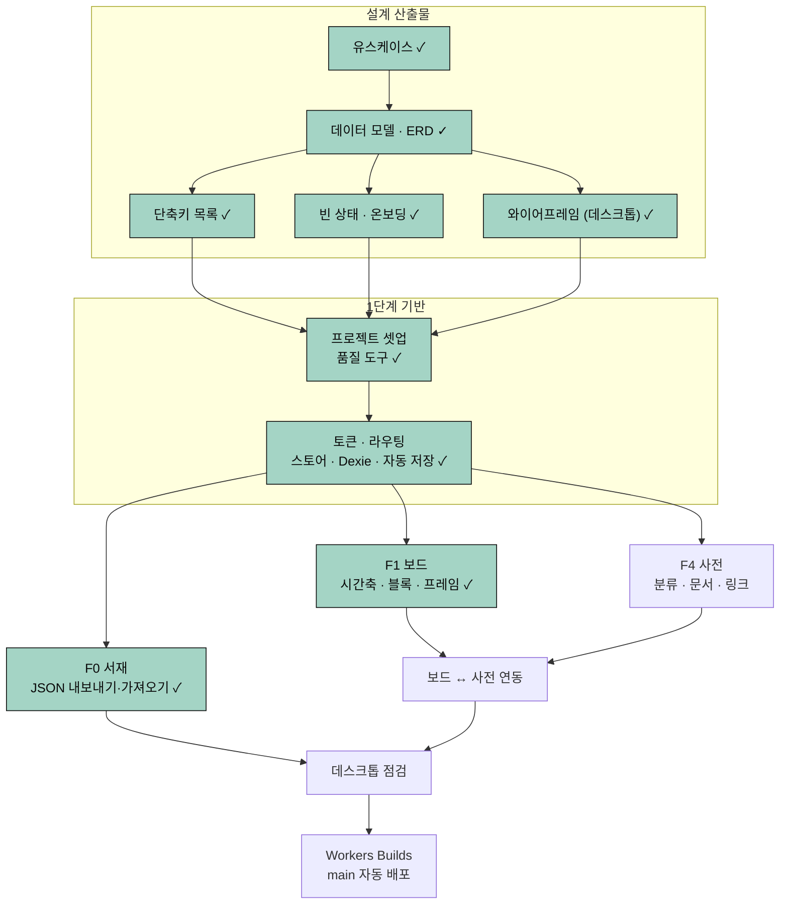

# TODO

남은 작업의 순서·의존 관계 (설계 산출물 → MVP 배포)

```mermaid
%%{init: {"flowchart": {"wrappingWidth": 320}}}%%
flowchart TB
    subgraph DESIGN["설계 산출물"]
        direction LR
        UC["유스케이스 ✓"]:::done --> DM["데이터 모델 · ERD ✓"]:::done
        DM --> SC["단축키 목록 ✓"]:::done
        DM --> ON["빈 상태 · 온보딩 ✓"]:::done
        DM --> WF["와이어프레임 (데스크톱) ✓"]:::done
    end

    subgraph BASE["1단계 기반"]
        direction LR
        SETUP["프로젝트 셋업<br/>품질 도구 ✓"]:::done --> CORE["토큰 · 라우팅<br/>스토어 · Dexie · 자동 저장 ✓"]:::done
    end

    SC --> SETUP
    ON --> SETUP
    WF --> SETUP
    CORE --> F0["F0 서재<br/>JSON 내보내기·가져오기 ✓"]:::done
    CORE --> F1["F1 보드<br/>시간축 · 블록 · 프레임 ✓"]:::done
    CORE --> F4["F4 사전<br/>분류 · 문서 · 링크"]
    F1 --> LINK["보드 ↔ 사전 연동"]
    F4 --> LINK
    F0 --> QA["데스크톱 점검"]
    LINK --> QA
    QA --> DEPLOY["Workers Builds<br/>main 자동 배포"]

    classDef done fill:#a4d4c5,stroke:#0a0a0a,color:#0a0a0a
```
MVP는 데스크톱 전용. 태블릿·모바일은 "MVP 이후 > 태블릿 · 모바일"

## 기획
- [x] 기능 명세 초안 ([features_spec.md](./design/features_spec.md))
- [x] 기술 스택 선정 ([tech_stack.md](./design/tech_stack.md))
- [x] UI 가이드 정리 ([ui_guide.md](./design/ui_guide.md))
- [x] 화이트보드 타임라인·소설별 관리·사전·메모 기획 반영

## 구현 전 결정 (모두 확정)
- [x] A1 작중 시간 모델 → 상대 순서(정수 눈금) + 눈금별 라벨
- [x] A2 시간 공백 처리 → 축 구간 접기(≈ 생략 표시), 눈금 간격은 균등
- [x] A3 시점 불명 사건 → 시간축 왼쪽 "미정 영역"에 배치 허용
- [x] A4 캐릭터 상태 "변화" 구조화 → 사전 속성 변경(키: 이전값→새값) + 자유 메모. 시점별 상태 = 속성 변경 누적
- [x] A5 소설당 보드 개수 → 1개 + 프레임으로 구분
- [x] A6 서술 순서 단위 → 사건 1개를 여러 회차 슬롯에 배치 허용(부분 공개)
- [x] A7 MVP 범위 → F0 서재 + F1 보드 + F4 사전 + F6 로컬 저장. F2·F3·F5·도형·정렬 보조선은 MVP 이후
- [x] A8 모바일 지원 수준 → 보기 + 간단 편집(사전·메모 편집, 보드 이동·확대, 블록 내용 수정), 보드 배치 편집은 태블릿 이상 → **MVP 이후로 연기** (2026-09-28, 확인 기기 없음)
- [x] A9 로컬 데이터 유실 대책 → `navigator.storage.persist()` + 주기적 JSON 백업 알림. **로그인·유저별 DB(2단계) 도입 전까지** 적용
- [x] A10 서비스명 → WhiteNoard (`whitenoard.<계정>.workers.dev`), 커스텀 도메인은 추후
- [x] A11 다크 모드 → MVP 제외
- [x] B 기술 선택 → Zustand + zundo, Dexie, React Router, Lucide, ESLint + Prettier + Vitest + Playwright, 검색은 부분 일치(초성 검색은 MVP 이후)
- [x] B11 배포 방식 → **GitHub + Cloudflare Workers Builds** (main 푸시 시 자동 배포, 무료 티어)
- 보류: 2단계 인증 방식, 관계도 보기, 이미지 R2 저장, 보드 공동 편집

### MVP 이후 결정 (미정)
- [ ] F7 개요 탭: 시놉시스 본문 저장 위치(Novel 필드 추가 vs 전용 문서), 탭 순서 · 단축키(`Alt+1~3` 재배치 여부), `UiState.lastTab` 확장
- [ ] 문서 목록 사이드바: 사전 패널과 동시 표시 여부 (1024px 화면 캔버스 폭)

## 기술 스파이크 (구현 전 소규모 프로토타입)
검증 방법·합격 기준·결과 기록: [spikes.md](./design/spikes.md). 위험도순 정렬.

- [x] 스파이크 앱 준비: `spikes/` 폴더 (`spike` 브랜치), 자동 검증 1차 완료 (2026-09-25)
- [x] PC 실제 한글 입력기 확인 (C1·C2, 2026-09-25)
- [x] C1 한글 IME: 채택 (Tiptap 유지)
- [x] C2 보드 단축키 × IME: 채택 (자동·PC 실제 IME 통과)
- [x] C3 React Flow 성능: 대안 적용 (화면 밖 렌더 생략 기본 on + 축소 시 간략 표시)
- [x] C4 시간축: 채택 (`ViewportPortal` 유지)
- [x] C5 터치: 채택, 실기기 확인 전까지 위험 수용
- [x] C6 캔버스 인라인 편집: 채택 (`nodrag nowheel nopan`)
- [x] C7 프레임: 채택 (중첩 금지, 삭제 시 자식 유지)
- [x] C8 IndexedDB 용량: 대안 적용 (업로드 시 1600px WebP 리사이즈를 Web Worker에서 처리)

### 원격 실기기 확인 (MVP 이후 — 태블릿·모바일 개발 때)
- [ ] 스파이크 앱 배포: 별도 Worker `whitenoard-spike`
- [ ] 원격 테스트 준비: Samsung Developer 계정(Remote Test Lab), Android Studio 에뮬레이터, iOS 체험 서비스(BrowserStack / LambdaTest)
- [ ] C1 삼성 키보드 · iOS Safari 한글 입력·`@` 멘션
- [ ] C3 Galaxy A 실측 → 권장 요소 수 상한 결정
- [ ] C5 실제 태블릿 1회 확인

## 설계 산출물 (구현 직전)
- [x] 유스케이스 ([usecase.md](./design/usecase.md))
- [x] 데이터 모델 확정본 ([data_model.md](./design/data_model.md)) — 9장 "기본값으로 정한 사항" 검토 필요
- [x] ERD 다이어그램 ([erd.md](./design/erd.md))
- 와이어프레임 (서재 / 보드 / 사전) ([wireframe.md](./design/wireframe.md))
  - [x] 데스크톱 (2026-09-25) — 6장 "기본값으로 정한 사항" 검토 필요
  - 태블릿 · 모바일 → MVP 이후
- [x] 단축키 목록 ([shortcuts.md](./design/shortcuts.md)) — 6장 "기본값으로 정한 사항" 검토 필요
- [x] 빈 상태·온보딩 ([onboarding.md](./design/onboarding.md)) — 샘플 소설 제공(가져오기 재사용) + 빈 보드 안내 카드, L-2 갱신 · B-9 · W-7 추가 (2026-09-26). 5장 "기본값으로 정한 사항" 검토 필요

## 1단계 (MVP)
### 기반
- [x] GitHub 원격 저장소 생성·연결 (`kty2001/NovelStory`)
- [x] 프로젝트 셋업: Vite + React + TypeScript + Tailwind v4 + Cloudflare Vite 플러그인 (2026-09-26)
- [x] 품질 도구: ESLint + Prettier + Vitest + Playwright (2026-09-26)
- [x] ui_guide 토큰·폰트를 Tailwind `@theme`에 반영 (사전 본문 H1~H3 스타일 포함 — preflight 초기화 대응, C1) (2026-09-26)
- [x] 라우팅 (React Router), 상태 관리 (Zustand + zundo — 편집 1회·드래그 1회 = 1건, 되돌릴 때 현재 노드와 병합, C2) (2026-09-26)
- [x] Dexie 저장 계층 + 자동 저장 + 내보내기 `schemaVersion` ([data_model.md](./design/data_model.md) 6·7장) (2026-09-26)
- [x] 데이터 유실 대책: `navigator.storage.persist()` + 백업 알림 (A9) (2026-09-26) — 요청 함수·배너 완료, 호출·내보내기 버튼은 F0에서 연결

### F0 서재
- [x] 소설 목록·생성·이름 변경·복제·삭제 (2026-09-26) — 표지 업로드(Web Worker WebP 변환), 되돌리기 알림 포함
- [x] 소설 단위 JSON 내보내기 / 가져오기 (2026-09-26) — 서재 카드·작업공간 ⋯ 메뉴·백업 배너
- [x] 빈 서재(L-2) + 샘플 소설 (2026-09-26): `public/samples/sample.whitenoard.json` 작성, 가져오기 경로로 추가, Vitest 가져오기 테스트 ([onboarding.md](./design/onboarding.md) 4장)
- [x] 첫 소설 생성 시 `persist()` 1회 요청 (2026-09-26)

### F1 화이트보드 타임라인
- [x] React Flow 캔버스 (줌·팬·미니맵·점 격자, `onlyRenderVisibleElements` 기본 on, 줌 0.5 미만 간략 표시 — C3) (2026-09-28) — 줌 컨트롤·화면 위치 복원 포함. 간략 표시는 `.board-simple` 클래스만(블록 구현 시 적용), 줌 단축키(`+`·`-`·`Shift+0~2`)는 단축키 작업에서
- [x] 시간축: 정수 눈금 + 눈금 라벨 + x ↔ 눈금 변환 + 스냅 (스파이크 `timeAxis.ts` 이식) (2026-09-28) — 라벨 클릭 편집(한글 조합 Enter 무시), 우클릭 메뉴(앞에 눈금 삽입 · 라벨 편집/지우기), 첫 화면 0 눈금 중앙. 스냅은 함수·테스트까지(블록 드래그 때 적용), 눈금 간격·스냅 토글은 보드 설정 작업에서
- [x] 시간축 구간 접기 (A2) (2026-09-28) — `Shift+클릭` · 우클릭 "여기부터 구간 선택" → 다른 눈금 클릭 → "≈ 구간 a~b 접기", `≈ a~b` 칩 클릭 = 펼치기, 겹친 구간 병합. 눈금 끌어서 구간 선택은 미구현
- [x] 미정 영역 (A3) (2026-09-28) — x < 0 = 시점 미정, 0 눈금 왼쪽 점선 상자(폭 240 · 높이 560). 블록 구현 시 미정 블록 범위에 맞춰 높이 확장
- [x] 미니맵에 시간축 · 미정 영역 표시 (B-9 메모 6) (2026-09-28) — 조작 불가 장식 노드(`__axis`·`__undated`)로 추가, 화면 맞춤도 둘을 포함. 축 길이 = 마지막 눈금 + 5, 미정 영역은 미정 블록 범위에 맞춰 확장
- [x] 도구 모음 → 캔버스 드래그 배치 (Pointer Events) (2026-09-28) — 도구 모음(V H │ E C S T F L │ 스냅), 끌어 놓기 · 도구 선택 후 클릭 배치, 반투명 미리보기 + 스냅 눈금 가이드, `Alt` = 스냅 일시 해제, 배치 후 선택 도구 복귀, 도구 단축키(`code` 기준), 손 도구 팬. 사건 블록 자동 문서 생성(`autoCreated`). C·S·T·F·L 도구는 각 블록 항목에서 활성화
- [x] 사건 블록 (단일 시점 / 기간 리사이즈) (2026-09-28) — 배치 직후 · 더블클릭 · `F2` 제목 편집(= 사건 문서 제목), 끌어서 시점 이동(스냅, `Alt` 해제, 미정 영역 오가기, 끌기 1회 = 1건), 선택 시 양 끝 핸들로 기간 조절, 시간축까지 점선 지시선, 블록 메뉴 색 변경, 미니맵 블록 색. 태그 · 상세(사전 패널)는 보드 ↔ 사전 연동에서
- [x] 스토리 라인: 기본 메인·서브·사이드, 블록 메뉴 지정(다중 선택), 배지·테두리, 필터, 라인 편집 (UC-23) (2026-09-28) — 블록 메뉴(색 · 라인, 여러 개 선택 시 한꺼번에), `Shift`·`Ctrl`+클릭 다중 선택, 라인 순서별 테두리 + 배지(간략 표시에선 배지 숨김), 필터 메뉴(라인 · 미지정, 사건 수, 소설별 기억), 라인 편집(이름 · 추가 · 끌어서 순서 · 삭제 확인). 필터의 캐릭터 · 태그 · 분류 항목은 해당 기능 구현 시
- [x] 캐릭터 상태 블록 (등장·변화·퇴장, 속성 변경 입력) + "캐릭터별 정렬" (2026-09-28) — C 도구(반복 = 유형 순환) → 캐릭터 선택(제목 · 별칭 검색, 없으면 새 캐릭터 문서) → 입력 패널(유형 탭 · 속성 변경 행 + 이전값 자동 채움 · 메모 · 관련 사건 점선 연결), 퇴장 이후 ⚠ 경고, 왼쪽 끝 = 눈금 + 지시선. 캐릭터별 정렬: 레인 · 교차 배경 · 등장~퇴장 빗금 띠 · 왼쪽 고정 레인 머리(끌어서 순서), 끄면 원래 위치. 레인 모드에서 상태 블록 세로 끌기는 무시(순서 변경은 레인 머리로)
- [x] 포스트잇 · 텍스트 · 프레임 (프레임 삭제는 자체 처리, `deleteKeyCode={null}` — C7) (2026-09-28) — S · T 배치 즉시 편집(더블클릭 · `F2` 재편집, Esc · 바깥 클릭 = 확정), 포스트잇 색 · 크기 조절. F 도구로 영역 그리기(안의 요소 편입) · 클릭 = 기본 크기, 제목 편집, 크기 조절, 중심점 기준 소속(배치 · 끌기), 프레임 이동 시 자식 함께 이동(시간 블록은 눈금 재계산), `Ctrl+G` 묶기 · `Ctrl+Shift+G` 풀기, `Delete` · 블록 메뉴 삭제(프레임 자식 유지, 관련 사건 연결 정리). 비어 있는 자동 생성 사건 문서는 소설을 열 때 정리(실행 취소 대비)
- [x] 연결선 (화살표·라벨·점선) (2026-09-28) — 사건 · 상태 · 포스트잇 · 텍스트 네 면 핸들(마우스 올림 · 선택 시 표시)에서 끌어 연결, 연결선 도구(L) = 요소 전체에서 끌기(마주 보는 면 자동 선택, 1회 후 선택 도구), 화살촉 · 가운데 라벨 알약 · 실선/점선(더블클릭 · `F2` · `Enter` 편집), 선택 시 brand-teal, `Delete` 삭제(블록 삭제 시 이어진 선도), 필터로 숨긴 블록의 선 숨김
- [x] 다중 선택, 복사·붙여넣기, 실행 취소 / 다시 실행 (2026-09-28) — 박스 선택 · `Shift`/`Ctrl`+클릭 · `Ctrl+A` · `Tab`/`Shift+Tab`(화면 위치 순), `Ctrl+C/X/V`(마우스 위치, 캔버스 밖이면 +24px씩) · `Ctrl+D`(+24px), 사건 블록은 문서 복제(1:1, 태그 · 라인 포함), 선택 프레임의 자식 · 양 끝 포함 연결선 함께 복사, `Ctrl+Z` · `Ctrl+Shift+Z` · `Ctrl+Y`(텍스트 편집 중엔 입력칸 동작). 사전 문서는 실행 취소 기록 밖이라 붙여넣기를 되돌려도 복제된 사건 문서는 남음(빈 문서만 소설 열 때 정리). 방향키 이동 · 줌 단축키는 단축키 작업에서
- [x] 빈 보드 안내 카드 · 필터로 전부 숨김 알림 (B-9) (2026-09-28) — 요소 0개일 때만 화면 고정 안내 카드(3단계 · 포인터 통과로 카드 아래에도 배치), 사건 · 캐릭터 상태 도구 강조, 첫 배치 즉시 사라짐. 요소가 모두 필터로 숨겨지면 "필터로 N개 숨김 · 필터 해제" 알림. "단축키 보기 ?"는 단축키 도움말 구현 시
- [x] 단축키 마무리 (shortcuts 1 · 2.3 · 2.4) (2026-09-29) — 방향키 이동(시간 블록 ←→ 1 눈금 · 그 외 8px, `Shift` 5 눈금 · 40px, 0 눈금에서 멈춤, 미정 ↔ 시간축 넘나들지 않음, 레인 모드 상태 블록 ↑↓ 무시, 프레임은 자식과 함께, 누르고 있는 동안 = 실행 취소 1건, 프레임 소속은 재판정하지 않음), 줌(`+` · `-` · 숫자패드, `Shift+0` 100% · `Shift+1` 화면 맞춤 · `Shift+2` 선택 요소에 맞춤), `Esc` 선택 도구에서 선택 해제, React Flow 노드 키 처리 끔(`disableKeyboardA11y`). 공통: `Alt+1/2` 탭 전환, `Ctrl+S` "자동 저장됨" 알림, `?` 단축키 도움말 대화상자(상단 바 `?` 버튼 · ⋯ 메뉴 · 빈 보드 안내 카드 "단축키 보기")

### F4 사전
- [x] 분류 트리 (기본 분류 + 사용자 분류, 계층, 드래그 정렬) (2026-09-29) — 좌측 트리 240px(색 점 · 🔒 system · 문서 수(하위 포함) · 접기, 하위 분류 다음 문서 가나다순), `+ 분류` · 우클릭/⋯ 메뉴(이름 변경 · 하위 분류 만들기 · 삭제 — 비어 있는 사용자 분류만, 비활성 이유 표시), 더블클릭 이름 변경, HTML 끌어 놓기(행 위 · 가운데 · 아래 = 앞 · 하위 · 뒤, system 분류 끌기 불가, 보드에 쓰인 문서가 있으면 계열 이동 불가 + 이유 알림, 사건 계열 이탈 시 라인 제거). 분류 화면 최소(머리 · 사용자 분류 색 팔레트 · 문서 목록, `?category=`), `+ 새 문서`(템플릿 빈 속성) → 문서 자리 표시(제목만). 검색칸 · 표 · 설정 탭 · 빈 분류 안내는 각 항목에서
- [x] 문서 편집: 제목·별칭·속성·태그·스토리 라인(사건)·본문(Tiptap)·대표 이미지 (Web Worker 리사이즈 + 진행 표시 — C8) (2026-09-29) — Tiptap v3 추가(mention · suggestion은 설치 + 멘션 노드 표시만). 제목(비우면 유지) · 별칭 · 태그 칩(Enter 추가, 한글 조합 무시, 중복 무시), 사건 계열만 라인 선택, 속성 표(템플릿 키, 추가 · 삭제 · ⋮⋮ 끌어서 순서, 중복 키 거부 · `Esc` 복원), 대표 이미지(Worker 변환 중 표시 · 실패 안내 · 교체 시 이전 이미지 삭제 · 제거), 본문(H1~H3 · 굵게 · 기울임 · 목록 · 인용 도구 모음, 빈 본문 null, 파생 필드 계산, 읽지 못한 본문은 편집 막음). 문서 ⋯ 메뉴: 분류 이동(보드 문서는 같은 계열만, 사건 계열 밖이면 라인 제거) · 삭제(보드 블록이 있으면 비활성 — 경고 · 함께 삭제는 보드 연동에서)
- [x] 템플릿 (분류별 기본 속성) (2026-09-29) — 분류 화면 탭(문서 목록 · 설정, 표 탭은 표 보기에서). 설정 탭: 분류 이름 · 상위 분류(옮길 수 없는 항목 비활성) · 색(사용자 분류만, 팔레트를 머리에서 이동) · 템플릿 키(속성 표 재사용: 추가 · 이름 변경 · 끌어서 순서 · 삭제 · 중복 거부) + "새 문서에만 적용, 기존 문서 N개는 그대로" 안내. 기본 분류는 🔒 안내 · 상위 분류 · 색 잠금
- [x] `@` 링크 + 역링크 (2026-09-29) — 본문 `@` + 글자 → 제목 · 별칭 부분 일치 후보(현재 문서 제외, 제목 앞부분 우선, 8개, 별칭 일치 표시), `↑↓` · `Enter`/`Tab` 삽입 · `Esc` 닫기, 한글 조합 중 키 무시. 링크 칩(분류 색 점 + 대상의 현재 제목, 클릭 = 문서 열기), 깨진 링크(점선 · 취소선 · 저장된 label, 클릭 시 알림). 문서 하단 역링크(분류 · 제목 · 언급 문맥 `<mark>`, 클릭 이동). 등장 사건 · 상태 이력 · 관련 캐릭터는 보드 연동에서
- [x] 표 보기, 전체 검색 (부분 일치) (2026-09-29) — 분류 화면 "표" 탭(하위 분류 문서 포함, 제목 열 고정 · 라인(사건 계열) · 태그 · 속성 열(템플릿 키 → 쓰인 키) · 하위 분류, 열 머리 정렬(사건 계열 기본 = 라인 순서), 속성 셀 바로 수정 `Enter` 아래 칸 · `Tab` · `Esc`, 없는 키는 추가). 트리 위 검색칸(제목 → 별칭 → 본문 순, 분류별 결과 수 탭, `<mark>` 문맥, × · `Esc` · 이동 시 트리 복귀, 검색 중 트리 흐리게). 빠른 이동 `Ctrl+K` · 상단 바 검색칸(B-8): 문서(제목 · 별칭) + 시점(숫자 = 눈금, 라벨 일치) → 문서 열기 / 보드 해당 눈금 가운데(접힌 구간이면 펼침). 표 열 선택(열 ▾)은 남음
- [x] 보드 연동: 블록 ↔ 문서 1:1, 문서 → 보드 드래그, 삭제 경고 (2026-09-29) — 보드 우측 사전 패널(약 400px, 캔버스를 밀어냄: 블록 메뉴 "상세" · `Enter`, 패널 편집이 블록 제목 · 태그에 즉시 반영, 패널 안 링크는 패널에서 전환, "사전에서 열기", 연 문서 기억), 패널 손잡이 끌어 놓기(사건 = 블록 생성 · 이미 있으면 그 블록으로, 캐릭터 = 등장 상태 블록, 프레임 소속), 사건 블록 태그 표시. 문서 "보드에서 보기 · N"(블록 선택 + 화면 이동), 문서 하단 보드 연동 칸(캐릭터 = 등장 사건 · 상태 변화 이력, 사건 = 작중 시점 · 관련 캐릭터, 클릭 = 보드 그 블록), 표에 작중 시점 · 관련 캐릭터 열, 빠른 이동 문서 → 보드에서는 사전 패널. 문서 삭제 경고(W-6: 블록 · 연결선 수, 깨진 링크 수) → 블록 · 연결선 · 레인 순서 함께 삭제, 보드 실행 취소 기록 비움. 필터의 캐릭터 · 태그 · 분류 항목은 남음
- [x] 빈 분류 · 검색 0건 · 빠른 이동 0건 · 빈 역링크 안내 (W-7) (2026-09-29) — 공통 `EmptyState`(제목 · 보조 문구 · 버튼 최대 2개). 빈 분류(문서 목록 · 표 탭): 캐릭터 · 사건 계열 = 보드 자동 생성 안내 + 템플릿 키 + "새 ○○ 문서" · "보드로 가기", 그 외 = 템플릿 안내(키 없으면 설정 탭 안내). 검색 0건: "'q'과/와 일치하는 문서가 없어요"(받침 조사) + "'q' 문서 만들기"(선택 분류) · "검색 지우기". 빠른 이동 0건: 숫자 입력 안내. 문서 하단: 빈 역링크 · 보드 연동 0(끌어 배치 안내, 패널 안 문구 구분). 사전 첫 진입 = 첫 분류(캐릭터) 화면

### 배포
- [x] 데스크톱 점검 (Chrome · Edge) — 1차 (2026-09-29): 자동(lint · Vitest · build · e2e Chromium · Edge), Chrome 수동(서재 · 보드 · 사전 · 새로고침 유지 · 단축키 앱 동작), 1024 · 1366px 캡처 완료. 사용자 확인: 실제 한글 입력기 · 실제 키보드의 브라우저 단축키 충돌(`Ctrl+S` · `Ctrl+D` · `Alt+1/2` · `+`/`-`) · 배율 125 · 150% 문제없음. 2차: 좁은 캔버스 도구 모음 아이콘만(`@container`), `<mark>` · 멘션 칩 조사 간격, 보드 · 사전 지연 로드(최대 청크 462kB), 배율 메뉴(직접 입력 · 프리셋). 남은 것: 요소 수백 개 성능 체감
- [x] Cloudflare Workers Builds에 GitHub 저장소 연결 → main 자동 배포

## MVP 이후
권장 순서: 사전 시점 선택 보기 → F7 개요 탭 → 문서 목록 사이드바 → 설정 점검 ([features_spec.md](./design/features_spec.md))

- [ ] F3 캐릭터 상태 조회 → 사전 시점 선택 보기: 캐릭터 문서 · 표에서 눈금 선택 시 속성 변경 누적 상태 표시, 달라진 칸 강조 (`stateAt` 재사용)
- [ ] F7 개요 탭: 시놉시스 본문 + 스토리 흐름 자동 요약(프레임 → 라인 → 사건 시점순)
- [ ] 보드 문서 목록 사이드바: 캐릭터 · 사건 문서 끌어 놓기 배치, 검색, 보드에 없는 문서 필터
- [ ] 사전 설정 점검 화면: 보드에 없는 문서 · 퇴장 이후 상태 · 미정 사건 · 깨진 링크 · 빈 속성
- [ ] F2 서술 순서: 회차 목록 + 사건 배치(여러 회차 허용), 서술 방식 표시, 보드 위 비교 오버레이
- [ ] F5 메모: 목록·핀 고정, 포스트잇·사전 문서 변환
- [ ] 보드 도형 (사각형·원·마름모)
- [ ] 정렬 보조선 (직접 구현)
- [ ] 스토리 라인 색 지정 (배지·테두리에 색 적용)
- [ ] 사전 초성 검색 (es-hangul)
- [ ] 사전 속성 값 문서 링크 (W-1 ⑥, `WikiProp.value` 형식 · `mentions` 계산 변경)

### 태블릿 · 모바일 (기기 확보 후)
2026-09-28 MVP에서 제외 (확인 기기 없음). 지원 수준은 A8, 기기별 동작은 설계 문서(usecase·ui_guide 등) 그대로
- [ ] 와이어프레임 태블릿 · 모바일
- [ ] 반응형 레이아웃 (태블릿 / 모바일)
- [ ] 터치 조작 (핀치 줌, 길게 눌러 메뉴), 모바일 편집 제한 (A8)
- [ ] 원격 실기기 확인 (C1·C3·C5, 위 "기술 스파이크" 절)

## 2단계
- [ ] 인증 방식 결정
- [ ] Workers API + D1 스키마 (유저별 데이터)
- [ ] 로컬 ↔ 서버 동기화 (D1 무료 한도 고려한 디바운스 저장)
- [ ] 로그인 도입 후 A9 백업 알림 정책 재검토
- [ ] 이미지 저장소 (R2) 검토
