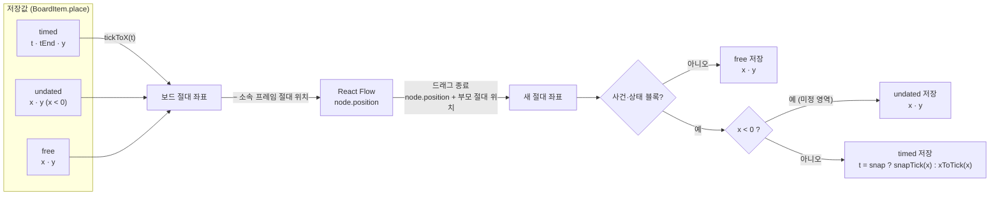

# 데이터 모델 (Data Model)

MVP(F0·F1·F4·F6) 구현 기준 확정본. [features_spec.md](./features_spec.md) 4장 초안을 [spikes.md](./spikes.md) 결과, [tech_stack.md](./tech_stack.md) 6장 데이터 규칙, [usecase.md](./usecase.md)에 맞춰 수정함.

- 엔터티 관계도: **[erd.md](./erd.md)**
- 아래는 보드 블록의 위치가 저장값에서 화면으로, 드래그 후 다시 저장값으로 가는 흐름 (4.1·4.2)


눈금 간격·구간 접기를 바꿔도 `t`는 그대로이고 화면 x만 다시 계산됨

## 1. 초안 대비 변경 요약

| 항목 | 초안 | 확정 | 근거 |
|---|---|---|---|
| 공통 필드 | 일부 레코드만 `updatedAt`, `deletedAt` 없음 | 모든 레코드 `BaseRecord`(`id`·`updatedAt`·`deletedAt?`) | 데이터 규칙 (2단계 동기화) |
| 사건·상태 블록 위치 | 픽셀 `x`, 작중 시점은 x에서 계산 | **눈금 좌표 `t`(·`tEnd`)가 원본**, x는 화면 표시 때 계산 | C4: 구간 접기·눈금 간격 변경·눈금 삽입 시 블록 위치 재계산 |
| 시간축 설정 | `pxPerTick`·라벨·접힌 구간 | + `collapsedPx`, `snap` | C4 `timeAxis.ts` `Scale` |
| 좌표 저장 | 프레임 자식은 상대 좌표(React Flow 방식) | **모두 보드 절대 좌표**, 상대 좌표 변환은 스토어에서 | C7: 프레임 삭제·WebKit 좌표 문제 단순화 |
| 쌓임 순서 | 없음 | `z` + 프레임 항상 먼저 | C7: 부모가 배열에서 자식보다 앞 |
| 프레임 중첩 | 제약 없음 | 금지 | C7 결정 |
| 이미지 | `string` | `ImageAsset` 테이블(Blob, WebP 1600px) + `imageId` 참조 | C8 |
| 사전 속성 | `Record<string, string>` | `{ key, value }[]` | 순서 유지 (숫자 키 재정렬 방지), 표 보기 열 순서 |
| 태그 | 없음 | `WikiDoc.tags` | F1 태그 배지·필터 |
| 스토리 라인 | 없음 | `StoryLine` 테이블 + `WikiDoc.lineId` (사건당 1개) | UC-23 메인·서브·사이드 구분 |
| 역링크·검색 | 조회 시 계산 | 저장 시 파생 필드 `mentions`·`plainText` 계산 (Dexie 색인) | 역링크 조회 비용 |
| 뷰포트 | `Board.viewport` | `UiState`(로컬 전용, 동기화·내보내기 제외) | 화면 이동이 수정 시각을 바꾸지 않도록 |
| 백업 시각 | 없음 | `Novel.lastExportedAt` | A9 백업 알림 |
| 서술 순서 참조 | `eventItemId` | `eventDocId` | 사건 문서는 보드 블록 없이도 존재 가능 (MVP 이후) |

## 2. 공통 규칙

- **ID**: `crypto.randomUUID()`. 단, `Board.id` = `novelId` (소설당 1개)
- **시각**: ISO 8601 문자열 (`new Date().toISOString()`)
- **`updatedAt`**: 모든 쓰기에서 갱신. 소설 하위 레코드가 바뀌면 같은 트랜잭션에서 `Novel.updatedAt`도 갱신 (서재 최근 수정순). `UiState`·`AppMeta` 변경은 제외
- **삭제**
  - 기본: `deletedAt` 기록(소프트 삭제). 모든 조회는 `deletedAt`이 없는 레코드만 사용
  - 소설 삭제: `Novel`만 소프트 삭제, 하위 레코드·이미지는 되돌리기 알림이 끝난 뒤 **물리 삭제** (2단계에선 `Novel` 삭제 기록으로 하위 삭제 전파)
  - `ImageAsset`: 참조가 없어지면 물리 삭제 (용량 대부분 차지, 1단계 동기화 대상 아님)
  - 삭제 기록 정리 시점은 2단계 동기화 설계 때 결정. MVP는 보관만 하고 내보내기에서 제외
- **색상**: 헥스 값이 아니라 [ui_guide.md](./ui_guide.md)의 **색 토큰 이름** 저장 (`brand-peach`, `sticky-yellow` 등) → 팔레트·다크 모드 변경 시 데이터 변환 불필요
- **실행 취소 기록**(zundo): 메모리에만 유지, 저장·내보내기 대상 아님

## 3. 타입

```ts
type ISODate = string;

type BaseRecord = { id: string; updatedAt: ISODate; deletedAt?: ISODate };
type NovelScoped = BaseRecord & { novelId: string };

type ColorToken = string; // ui_guide.md 토큰 이름 (예: 'brand-peach', 'sticky-yellow')

// ── 서재 ──
type Novel = BaseRecord & {
  title: string;
  genre?: string;
  synopsis?: string;
  coverImageId?: string;          // ImageAsset.id
  createdAt: ISODate;
  lastExportedAt?: ISODate;       // 마지막 JSON 내보내기 (A9 백업 알림)
};

// ── 이미지 (C8: 업로드 시 긴 변 1600px, WebP 0.8, Web Worker 변환) ──
type ImageAsset = NovelScoped & {
  blob: Blob;
  mime: string;                   // 보통 'image/webp'
  width: number; height: number;  // 변환 후 크기
  bytes: number;
};

// ── 사전 ──
type WikiCategory = NovelScoped & {
  name: string;
  parentId?: string;              // 상위 분류 (계층)
  order: number;                  // 같은 부모 안 순서
  templateProps: string[];        // 템플릿: 새 문서에 넣을 속성 키 (기존 문서엔 적용 안 함)
  color: ColorToken;
  system?: 'character' | 'event'; // 보드 연동 분류. 삭제·이동 불가, 이름 변경만 가능
};

type WikiProp = { key: string; value: string };

// 사건의 이야기 갈래 (UC-23). 새 소설마다 메인·서브·사이드 3개 생성
type StoryLine = NovelScoped & {
  name: string;                   // "메인", "서브", "사이드", 사용자 추가 라인
  order: number;                  // 표시 순서. 테두리 모양 = order 순번 (0 메인형, 1 서브형, 2 사이드형, 그 외 기본형)
  color: ColorToken;              // MVP 이후 라인 색 지정 대비. MVP는 기본값 저장만, 화면에 쓰지 않음
};

type WikiDoc = NovelScoped & {
  categoryId: string;
  title: string;
  aliases: string[];
  tags: string[];                 // 태그 배지·필터 (주로 사건)
  lineId?: string;                // 스토리 라인 (사건 계열 문서만). 없으면 미지정
  props: WikiProp[];              // 순서 유지, 같은 key 중복 금지
  body: TiptapJSON | null;        // mention 노드: { type: 'mention', attrs: { id: docId, label } }
  imageId?: string;               // 대표 이미지 ImageAsset.id
  color?: ColorToken;             // 캐릭터 대표 색 (생성 시 팔레트 순환 배정)
  createdAt: ISODate;
  autoCreated?: boolean;          // 보드 블록 생성으로 자동 생성됨 (빈 문서 정리 판단용)

  // 파생 필드: 저장 시 body에서 계산, 내보내기 제외 (가져오기 때 다시 계산)
  mentions: string[];             // body가 가리키는 docId 목록 (중복 제거) → 역링크 색인
  plainText: string;              // body 순수 텍스트 → 부분 일치 검색
};

// ── 보드 ──
type Board = BaseRecord & {       // id = novelId
  novelId: string;
  timeScale: {
    pxPerTick: number;            // 눈금 간격 (px)
    collapsedPx: number;          // 접힌 구간 표시 폭 (px)
    tickLabels: Record<string, string>; // 키 = 눈금 정수의 문자열 ("3": "1년차 봄")
    collapsed: { from: number; to: number }[]; // from < to, 겹침 없음, from 오름차순 저장
    snap: boolean;                // 눈금 스냅 (기본 true)
  };
  stateLanes: {                   // "캐릭터별 정렬"
    enabled: boolean;
    order: string[];              // 캐릭터 docId 순서 (새 캐릭터는 끝에 추가)
  };
};

// 블록 위치: 3가지 방식
type TimedPlace   = { mode: 'timed'; t: number; tEnd?: number; y: number }; // 시간축 위. t = 블록 왼쪽 끝 눈금 좌표 (스냅 off면 소수)
type UndatedPlace = { mode: 'undated'; x: number; y: number };             // 미정 영역 (x < 0)
type FreePlace    = { mode: 'free'; x: number; y: number };                // 시간 무관 요소
// 좌표는 모두 보드 절대 좌표 (프레임 기준 아님)

type BoardItemBase = NovelScoped & {
  z: number;                      // 쌓임 순서 (같은 종류 안에서)
  parentFrameId?: string;         // 소속 프레임 (프레임 자신은 없음 = 중첩 금지)
};

type EventItem = BoardItemBase & {
  kind: 'event';
  place: TimedPlace | UndatedPlace;
  docId: string;                  // 사건 계열 문서 (1:1)
  color: ColorToken;              // 기본 'brand-peach'
};

type PropChange = { key: string; from?: string; to: string }; // from = 입력 당시 누적값 (표시용)

type StateItem = BoardItemBase & {
  kind: 'state';
  place: TimedPlace | UndatedPlace; // tEnd 없음 (단일 시점)
  docId: string;                  // 캐릭터 계열 문서 (N:1)
  stateType: 'appear' | 'change' | 'exit';
  changes: PropChange[];          // appear: 초기값(from 없음), change: 변경, exit: 선택
  note: string;                   // 자유 메모 (퇴장 사유 등)
  linkedEventItemId?: string;     // 관련 사건 블록
};

type StickyItem = BoardItemBase & {
  kind: 'sticky';
  place: FreePlace;
  w: number; h: number;
  text: string;
  color: ColorToken;              // 기본 'sticky-yellow'
};

type TextItem = BoardItemBase & {
  kind: 'text';
  place: FreePlace;
  w: number;                      // 높이는 내용에 맞춤
  text: string;
};

type FrameItem = BoardItemBase & {
  kind: 'frame';
  place: FreePlace;
  w: number; h: number;
  title: string;
  parentFrameId?: never;
};

type BoardItem = EventItem | StateItem | StickyItem | TextItem | FrameItem;
// MVP 이후: ShapeItem { kind: 'shape'; place: FreePlace; w; h; shape: 'rect' | 'ellipse' | 'diamond'; color; text }

type BoardEdge = NovelScoped & {
  source: string; target: string;              // BoardItem.id
  sourceHandle?: string; targetHandle?: string; // React Flow 핸들 위치
  label?: string;
  dashed: boolean;
};

// ── 로컬 전용 (동기화·내보내기 제외) ──
type UiState = {
  novelId: string;                // 기본 키
  viewport: { x: number; y: number; zoom: number };
  lastTab: 'board' | 'wiki';
  wikiPanelDocId?: string;
  backupSnoozedUntil?: ISODate;   // 백업 알림 "나중에"
  filters?: { hiddenDocIds: string[]; hiddenTags: string[]; hiddenCategoryIds: string[]; hiddenLineIds: string[] }; // hiddenLineIds의 'none' = 미지정
};

type AppMeta =                    // key-value
  | { key: 'persist'; requestedAt: ISODate; granted: boolean }
  | { key: 'librarySort'; value: 'updated' | 'title' };

// ── MVP 이후 ──
type Episode = NovelScoped & { number: number; title?: string };

type NarrativeSlot = NovelScoped & {
  episodeId: string;
  order: number;
  eventDocId: string;             // 사건 문서 (보드 블록 없이도 배치 가능)
  mode: 'linear' | 'flashback' | 'flashforward' | 'foreshadow' | 'payoff';
  note?: string;                  // 부분 공개 범위 메모
};

type Memo = NovelScoped & { body: string; pinned: boolean; createdAt: ISODate };
```

## 4. 계산 규칙

### 4.1 시간축 (C4 `timeAxis.ts` 그대로 사용)
- 화면 x = `tickToX(t, scale)`, 기간 사건 폭 = `tickToX(tEnd) − tickToX(t)`. 단일 시점 사건·상태 블록 폭은 고정값(구현 상수)
- **작중 시점** = `Math.round(t)` (기간 사건 끝 = `Math.round(tEnd)`). `undated`는 시점 없음
- 드래그 종료: `snap`이면 `snapTick(x)`, 아니면 `xToTick(x)`. 결과가 `null`(x < 0)이면 `undated`로 전환
- 눈금 간격·접힌 구간 변경: `t`는 그대로, 화면 위치만 다시 계산
- 눈금 삽입(`insertTick`): `t ≥ at`인 블록의 `t`·`tEnd`, 라벨 키, 접힌 구간을 +1

### 4.2 보드 좌표 ↔ React Flow 노드
- 노드 절대 위치: `timed` = (`tickToX(t)`, `y`), 그 외 = (`x`, `y`)
- 노드 `position` = 절대 위치 − 소속 프레임 절대 위치 (`parentFrameId`가 있을 때만)
- 노드 배열 순서: 프레임 먼저(`z`순) → 나머지(`z`순). 부모가 자식보다 앞에 오는 조건 충족 (C7)
- 드래그 종료 시 절대 위치는 이벤트 인자 `node.position` + 부모 절대 위치로 계산 (WebKit에서 `internals.positionAbsolute`가 이전 값일 수 있음, C7)
- 프레임 이동: 소속 요소의 절대 좌표를 같은 만큼 이동. `timed` 요소는 새 x에서 `t` 재계산(스냅 규칙 동일) → 작중 시점도 함께 이동
- 프레임 소속: 드래그 종료 시 요소 중심점이 들어간 프레임
- 프레임 삭제: 소속 요소의 `parentFrameId`만 제거 (절대 좌표라 위치 변환 불필요)

### 4.3 캐릭터별 정렬
- `stateLanes.enabled`면 상태 블록 y = 레인 y(`order`의 캐릭터 순번 기준), 저장된 `place.y`는 수정하지 않음 → 끄면 원래 위치
- 레인 켠 상태에서 상태 블록을 세로로 끌면 레인 순서 변경으로 처리

### 4.4 캐릭터 상태 누적 (F3 대비, MVP에선 "이전값" 자동 채움에 사용)
- 시점 T의 상태 = 캐릭터 문서 `props` 위에, 작중 시점 ≤ T인 상태 블록의 `changes`를 (시점, 같은 시점이면 y, 그다음 `z`) 순서로 덮어씀
- `undated` 블록은 제외
- `from`은 입력 당시 표시용 기록. 누적 계산에는 `to`만 사용

### 4.5 사전 파생 필드
- 저장 시 `body`를 순회해 `mentions`(mention 노드 `attrs.id`, 중복 제거)·`plainText` 계산
- 역링크 = `wikiDocs.where('mentions').equals(docId)`
- 링크 표시 이름은 대상 문서의 **현재 제목** (mention `label`은 대상 삭제 시 깨진 링크 표시용)

## 5. 무결성 규칙

| 대상 | 규칙 |
|---|---|
| 사건 계열 / 캐릭터 계열 | `system` 분류(`event`·`character`)와 그 하위 분류 |
| `EventItem.docId` | 사건 계열 문서. 문서당 살아 있는 사건 블록 최대 1개 |
| `StateItem.docId` | 캐릭터 계열 문서. 문서당 여러 개 |
| 보드에 쓰인 문서 | 같은 계열 안에서만 분류 이동 가능 |
| `parentFrameId` | 같은 소설의 살아 있는 `frame`. 프레임은 소속 불가 |
| `BoardEdge` | `source`·`target`은 같은 소설의 살아 있는 블록. 블록 삭제 시 연결선도 삭제 |
| `StateItem.linkedEventItemId` | 사건 블록 삭제 시 제거 |
| 사건 블록 삭제 | 문서 유지. 단 `autoCreated`이고 내용이 비어 있으면(제목 외 속성·본문·별칭·태그·라인 없음) 함께 삭제 |
| 문서 삭제 (UC-35) | 연결 블록(사건 1개 / 상태 블록 전부)과 그 연결선 함께 삭제, `stateLanes.order`에서 제거 |
| 분류 삭제 | 비어 있는 분류만. `system` 분류 불가 |
| 문서 제목·분류 변경 | 링크(`mentions`)·블록(`docId`)은 문서 ID 기준이라 영향 없음 |
| `ImageAsset` | `Novel.coverImageId`·`WikiDoc.imageId` 어디에서도 참조하지 않으면 삭제 (소설 열 때 정리) |
| `timeScale.collapsed` | 저장 전 정렬·겹침 병합 |
| `WikiDoc.props` | 같은 `key` 중복 금지 (입력 시 검사) |
| `WikiDoc.lineId` | 같은 소설의 살아 있는 `StoryLine`. 사건 계열 문서만 (다른 계열로 옮기면 제거) |
| 라인 삭제 | 쓰던 문서의 `lineId` 제거(미지정) + `hiddenLineIds`에서 제거, 1개 트랜잭션. 라인 0개 허용 |

## 6. Dexie 스키마 (IndexedDB)

```ts
const db = new Dexie('whitenoard');
db.version(1).stores({
  novels:         'id, updatedAt',
  boards:         'id',                                   // id = novelId
  boardItems:     'id, novelId, docId, parentFrameId',
  boardEdges:     'id, novelId, source, target',
  wikiCategories: 'id, novelId, parentId',
  wikiDocs:       'id, novelId, [novelId+categoryId], *mentions',
  storyLines:     'id, novelId',
  images:         'id, novelId',
  uiState:        'novelId',
  meta:           'key',
});
```
- 소설 1개 분량(블록 수백~천 개)은 `novelId`로 한 번에 읽어 스토어에 올림 → 필터·검색은 메모리에서
- DB 구조 변경은 `db.version(n).upgrade()`로 처리. **DB 버전과 내보내기 `schemaVersion`은 별개**
- 여러 테이블에 걸친 변경(사건 블록 + 문서 생성, 문서 삭제 연쇄 등)은 `db.transaction('rw', ...)` 1건으로 처리

## 7. JSON 내보내기 형식

```ts
type NovelExport = {
  format: 'whitenoard-novel';
  schemaVersion: 1;
  exportedAt: ISODate;
  novel: Novel;
  board: Board;
  boardItems: BoardItem[];
  boardEdges: BoardEdge[];
  wikiCategories: WikiCategory[];
  wikiDocs: Omit<WikiDoc, 'mentions' | 'plainText'>[];
  storyLines: StoryLine[];
  images: (Omit<ImageAsset, 'blob'> & { dataUrl: string })[]; // Blob → base64 data URL
};
```
- 삭제 기록(`deletedAt` 있는 레코드), `UiState`, `AppMeta`, 파생 필드 제외
- 내보내기 성공 시 `Novel.lastExportedAt` 갱신
- **가져오기** (UC-05)
  1. `format` 확인, `schemaVersion`이 현재보다 크면 거부
  2. 낮으면 `migrations[v]`(v → v+1)를 차례로 적용
  3. 모든 ID 재발급 → 참조 필드(`novelId`·`docId`·`parentFrameId`·`source`·`target`·`linkedEventItemId`·`categoryId`·`parentId`·`lineId`·`imageId`·`coverImageId`·`stateLanes.order`)와 **본문 mention `attrs.id`** 일괄 치환
  4. 파생 필드 다시 계산, 1개 트랜잭션으로 저장 → 항상 새 소설로 추가

## 8. 유스케이스 대조

| 유스케이스 | 사용하는 타입·필드 |
|---|---|
| UC-01 첫 실행 | `Novel`, `Board`(기본 `timeScale`·`stateLanes`), `WikiCategory`(6개, `system`, `templateProps`, `color`), `StoryLine`(3개), `AppMeta.persist` |
| UC-02 목록 | `Novel.updatedAt`·`title`, `AppMeta.librarySort`, `UiState.lastTab`·`viewport` |
| UC-03 수정·복제·삭제 | `Novel`, `ImageAsset`, 삭제 규칙(2장), 복제 = 가져오기와 같은 ID 재발급 |
| UC-04·05 내보내기·가져오기 | `NovelExport`, `Novel.lastExportedAt`, 7장 |
| UC-10·11 사건 | `EventItem.place`(`t`·`tEnd`), `docId`, `color`, `WikiDoc.tags`·`autoCreated` |
| UC-12 상태 | `StateItem.stateType`·`changes`·`note`·`linkedEventItemId`, 4.4 |
| UC-13 레인 | `Board.stateLanes`, `WikiDoc.color`, 4.3 |
| UC-14·15 시간축 | `Board.timeScale`, 4.1 |
| UC-16 미정 영역 | `UndatedPlace`, 4.1 |
| UC-17 포스트잇·텍스트 | `StickyItem`, `TextItem` |
| UC-18 프레임 | `FrameItem`, `parentFrameId`, `z`, 4.2 |
| UC-19 연결선 | `BoardEdge` |
| UC-20 선택·복사·실행 취소 | `BoardItem`·`BoardEdge`(복사 시 ID 재발급, 사건은 문서도 복제), 실행 취소 기록은 비저장 |
| UC-21 둘러보기 | `UiState.viewport`, `filters` |
| UC-22 보드 ↔ 사전 | `BoardItem.docId`, `UiState.wikiPanelDocId` |
| UC-23 스토리 라인 | `StoryLine`, `WikiDoc.lineId`, `UiState.filters.hiddenLineIds`, 5장 라인 삭제 규칙 |
| UC-30~32 분류·문서·템플릿 | `WikiCategory`, `WikiDoc`(`props`·`aliases`·`tags`·`body`·`imageId`), `ImageAsset` |
| UC-33 링크 | `WikiDoc.body` mention, `mentions`, 4.5 |
| UC-34 표·검색 | `WikiDoc.props`·`plainText` |
| UC-35 문서 삭제 | 5장 연쇄 삭제 규칙 |
| UC-40~42 저장 | `updatedAt` 규칙, Dexie 트랜잭션, `Novel.lastExportedAt`, `UiState.backupSnoozedUntil` |

## 9. 기본값으로 정한 사항 (변경 가능)
- 사건 블록 삭제 시 사건 문서는 유지 (자동 생성된 빈 문서만 함께 삭제)
- 가져오기는 항상 새 소설로 추가 (기존 소설 덮어쓰기 없음)
- 소설 삭제는 휴지통 없이 되돌리기 알림만
- 좌표는 절대 좌표로 저장 (React Flow 상대 좌표는 스토어에서 변환)
- 백업 알림: 마지막 내보내기 후 7일, "나중에" = 3일
- 스토리 라인: 새 사건은 미지정, 라인은 사건 문서에 저장(블록 아님), 테두리 모양은 이름이 아닌 순서(`order`)로 결정, 라인 색 지정은 MVP 이후
