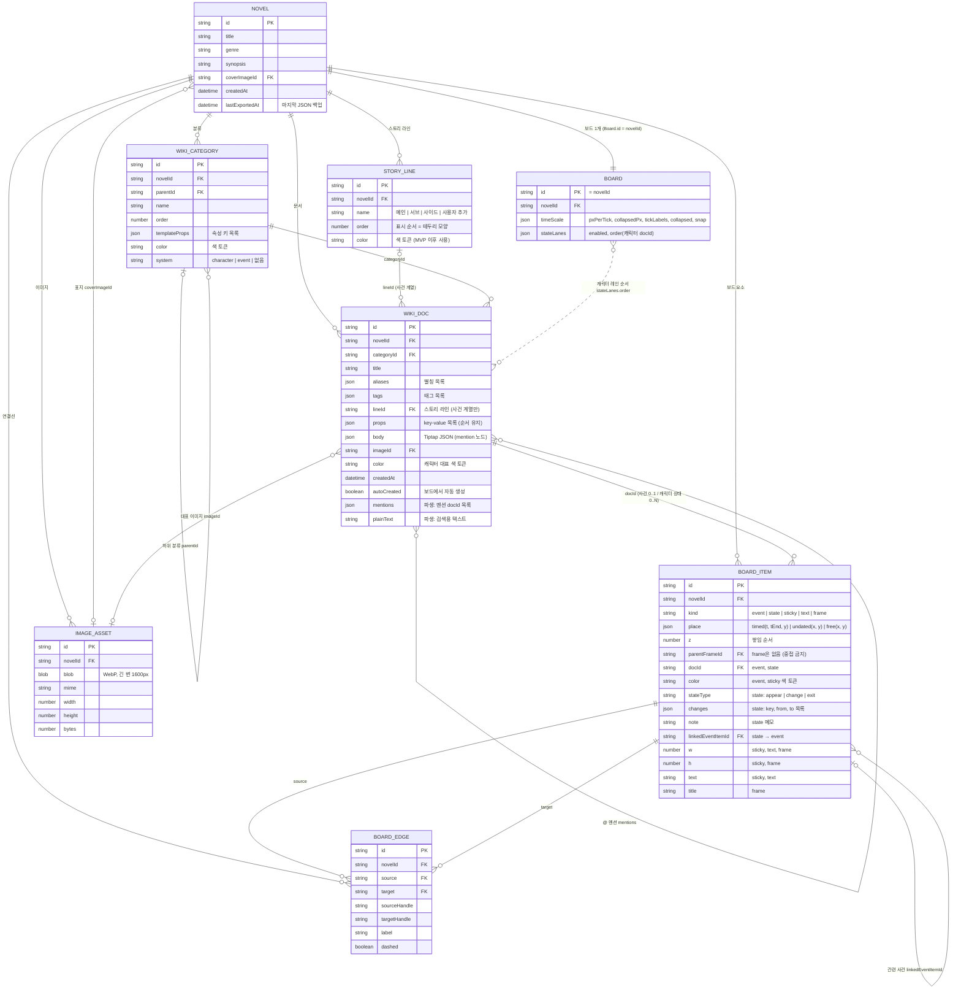
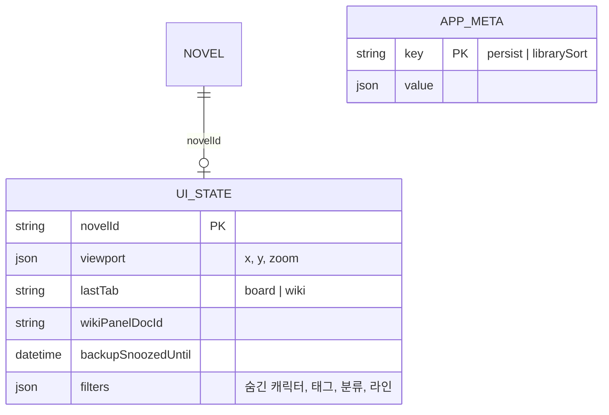
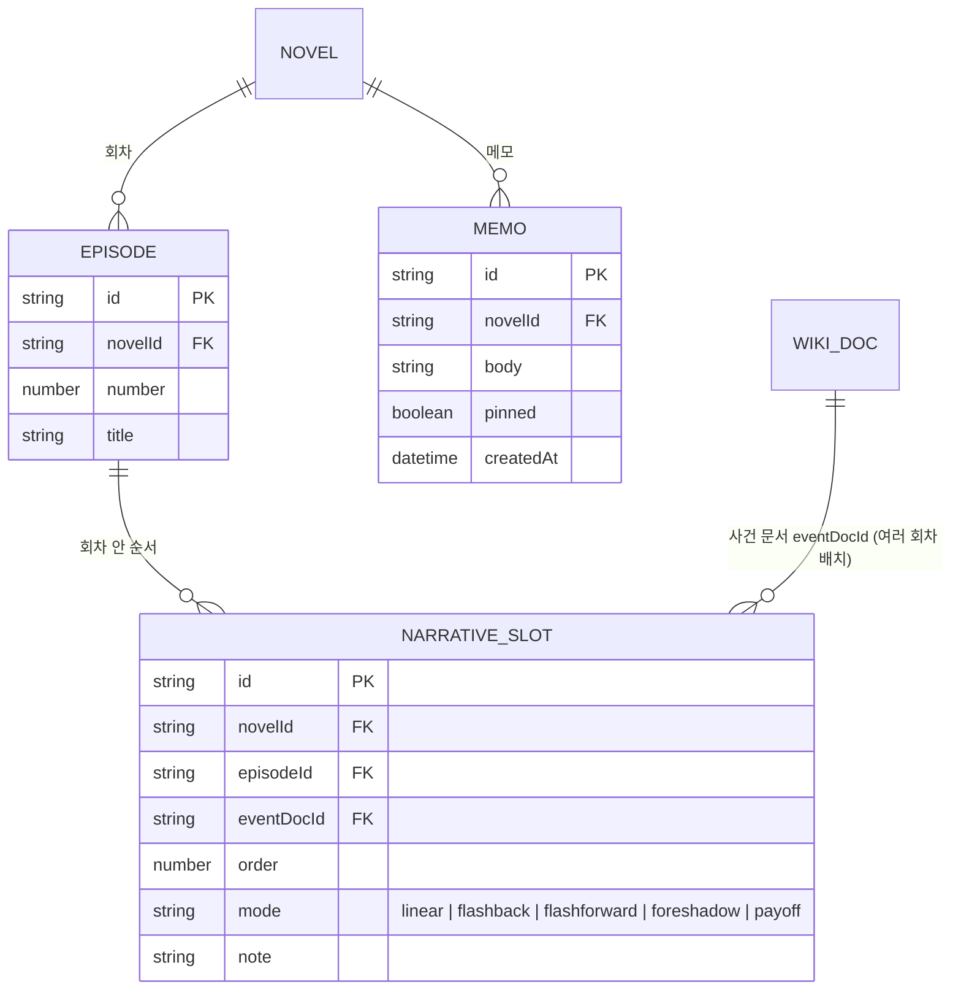

# ERD (Entity Relationship Diagram)

[data_model.md](./data_model.md)의 엔터티 관계를 시각화. 필드 의미·계산 규칙·무결성은 data_model.md가 기준.

- 모든 레코드 공통 필드: `id`(PK), `updatedAt`, `deletedAt`(소프트 삭제) — 아래 다이어그램에선 생략
- `json` = 배열·객체 필드, 괄호 안은 구조
- 저장소: IndexedDB(Dexie) 테이블 이름은 data_model.md 6장

## 1. MVP (F0 서재 · F1 보드 · F4 사전 · F6 저장)

### 관계 읽는 법
| 관계 | 설명 |
|---|---|
| `WIKI_DOC` → `BOARD_ITEM` | 사건 문서 1개 ↔ 사건 블록 최대 1개 (1:1). 캐릭터 문서 1개 ↔ 상태 블록 여러 개 (1:N). 블록 제목은 문서 제목을 그대로 표시 |
| `BOARD_ITEM` 자기 참조 | `parentFrameId`: 프레임 소속 (좌표는 절대 좌표라 소속만 표시). `linkedEventItemId`: 상태 블록 → 관련 사건 블록 |
| `WIKI_DOC` 자기 참조 | 본문 `@` 멘션. 원본은 `body`의 mention 노드, `mentions`는 역링크 조회용 파생 색인 |
| `STORY_LINE` → `WIKI_DOC` | 사건 문서 1개 ↔ 라인 0..1개. 라인 1개에 사건 여러 개. 라인 삭제 시 문서는 미지정 |
| `BOARD` ⇢ `WIKI_DOC` (점선) | 캐릭터별 정렬의 레인 순서. 외래 키가 아닌 ID 목록 |

## 2. 로컬 전용 (동기화·내보내기 제외)

## 3. MVP 이후 (F2 서술 순서 · F5 메모)

