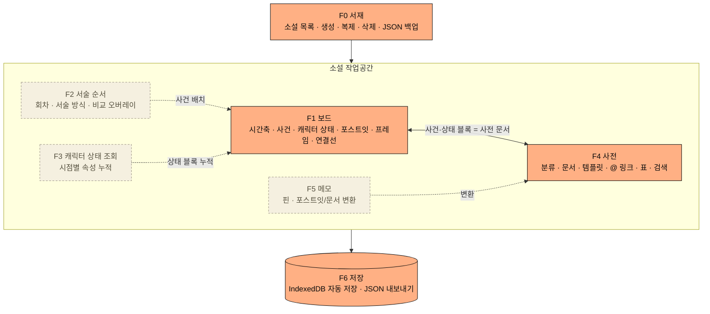

# 기능 명세 (Features Spec)


주황 = MVP, 점선 = MVP 이후

## 1. 개요
- **목적**: 웹소설 작가가 스토리를 시각적으로 설계하는 웹 서비스
- **대상**: 연재형 웹소설 작가 (회차 단위 집필, 다수 인물·복선·설정 관리 필요)
- **핵심 아이디어**
  - **소설별 관리**: 서재에서 작품 단위로 보드·사전·메모 관리 (뮤블 방식)
  - **화이트보드 타임라인**: 무한 캔버스에 시간축 선을 두고, 화이트보드에 쓰듯 블록·포스트잇·화살표를 자유롭게 배치
    - 시간축 **위쪽**: 사건 발생 시기 블록
    - 시간축 **아래쪽**: 캐릭터 등장·변화·퇴장 상태 블록
  - **서술 순서**: 작중 시간순과 소설 서술 순서를 분리해 관리
  - **설정 사전**: 캐릭터·사건·장소·세계관 등을 문서로 정리, 보드 블록과 하나로 연결
- **범위 제외**: 원고(본문) 집필 에디터

## 2. 핵심 개념 / 용어

| 용어 | 정의 |
|---|---|
| 소설 (Novel) | 작품 1개 단위. 보드·사전·메모·회차의 최상위 |
| 서재 (Library) | 사용자의 소설 목록 화면 |
| 보드 (Board) | 소설마다 1개인 무한 캔버스 화이트보드 |
| 시간축 (Time Axis) | 보드를 가로지르는 기준선. 가로 위치 = 작중 시점 |
| 작중 시간 (Story Time) | 작품 세계 안에서 사건이 일어난 순서. **상대 순서(정수 눈금)** 로 표현, 눈금마다 라벨("1년차 봄" 등) 지정 가능 |
| 사건 블록 (Event) | 특정 시점 또는 기간에 발생한 사건. 시간축 위쪽 배치 |
| 스토리 라인 (Story Line) | 사건이 속한 이야기 갈래 (메인·서브·사이드 등). 사건당 1개, UI 표기는 "라인" |
| 상태 블록 (Character State) | 캐릭터의 등장 / 변화 / 퇴장 기록. 시간축 아래쪽 배치 |
| 포스트잇 (Sticky) | 보드 아무 곳에나 붙이는 자유 메모 |
| 연결선 (Edge) | 블록·포스트잇 사이 화살표 (인과, 복선 등) |
| 프레임 (Frame) | 보드 요소를 묶는 영역 (예: 1부, 2부) |
| 사전 문서 (Wiki Doc) | 캐릭터·사건·장소·세계관 등 설정 문서 |
| 분류 (Category) | 사전 문서의 계층형 그룹 (캐릭터, 장소 등) |
| 속성 (Property) | 사전 문서의 키-값 정보 (나이, 소속 등) |
| 템플릿 (Template) | 분류별 기본 속성 묶음. 문서 생성 시 자동 적용 |
| 메모 (Memo) | 정리 전 아이디어를 적는 자유 메모 |
| 서술 순서 (Narrative Order) | 독자에게 보여지는 순서. 작중 시간순과 독립 |
| 회차 (Episode) | 서술 순서의 단위. 사건을 회차에 배치 |

## 3. 기능 목록

| 번호 | 기능 | MVP |
|---|---|---|
| F0 | 서재 (소설 관리) | ✅ |
| F1 | 화이트보드 타임라인 (메인) | ✅ (도형·정렬 보조선 제외) |
| F2 | 서술 순서 | 이후 |
| F3 | 캐릭터 상태 조회 | 이후 (상태 블록의 속성 변경 입력은 MVP에 포함) |
| F4 | 사전 | ✅ (초성 검색 제외) |
| F5 | 메모 | 이후 |
| F6 | 저장 / 불러오기 | ✅ (로컬 저장) |

### F0. 서재 (소설 관리)
- 소설 카드 목록 (표지, 제목, 장르, 최근 수정일)
- 소설 생성·이름 변경·복제·삭제
- 소설 정보: 제목, 장르, 소개(시놉시스), 표지 이미지
- 정렬: 최근 수정순 / 제목순
- 소설 단위 JSON 내보내기 / 가져오기

### F1. 화이트보드 타임라인 (메인)
- **캔버스**
  - 소설당 보드 1개. 1부·2부 등 구분은 프레임 사용
  - 무한 캔버스, 줌·팬 (마우스 휠 / 트랙패드 핀치 / 스페이스+드래그), 미니맵
  - 화면 맞춤, 특정 시점으로 이동
- **도구 모음**: 선택 / 사건 / 캐릭터 상태(등장·변화·퇴장) / 포스트잇 / 텍스트 / 도형 / 프레임 / 연결선
- **시간축**
  - 보드를 가로지르는 기준선 + 눈금·라벨
  - 축 위쪽 = 사건 블록, 축 아래쪽 = 캐릭터 상태 블록
  - 작중 시간 = **상대 순서(정수 눈금)**. 실제 날짜·달력 계산 없음
  - 눈금 라벨: 눈금을 클릭해 자유 텍스트 라벨 지정 ("1년차 봄", "왕국력 302년" 등), 라벨 없는 눈금은 숫자 표시
  - 블록의 가로 위치 → 가장 가까운 눈금으로 작중 시점 계산, 눈금 스냅 on/off
  - 눈금 간격(px) 조절, 눈금 사이 삽입(뒤쪽 눈금·블록 일괄 이동)
  - **구간 접기**: 선택한 눈금 구간(예: 10년 공백)을 ≈ 표시로 축소, 클릭 시 펼침. 구간 안 블록은 숨기지 않고 압축 표시
- **미정 영역**
  - 시간축 왼쪽 바깥의 별도 영역. 시점을 모르는 사건·상태 블록 배치
  - 이 영역 블록은 작중 시점 없음, 시간축으로 옮기면 시점 부여
- **사건 블록**
  - 단일 시점 또는 기간 (블록 가로 폭 = 기간, 양 끝 드래그로 조절)
  - 표시: 제목, 색상, 태그 배지, 스토리 라인 배지·테두리
  - **스토리 라인**: 사건마다 라인 1개 지정 (미지정 가능)
    - 기본 라인: 메인 / 서브 / 사이드. 소설마다 추가·이름 변경·순서 변경·삭제
    - 블록 메뉴에서 지정, 다중 선택 시 한꺼번에 지정. 사전 사건 문서에서도 지정
    - 보드 표시: 블록 안 라인 배지 + 라인별 테두리 모양(굵기·실선/점선)
    - 라인 색 지정은 MVP 이후
  - 생성 시 사전 문서(사건 분류) 자동 생성
- **캐릭터 상태 블록**
  - 유형: `등장` / `변화`(성격·관계·능력·소속 등) / `퇴장`(사망·이탈·봉인 등)
  - 내용 = **사전 속성 변경 목록**(키: 이전값 → 새값) + 자유 메모
    - 예: `소속: 기사단 → 반란군`, `상태: 생존 → 사망`
    - `등장`은 초기 속성값 설정 가능, `퇴장`은 퇴장 사유 메모
  - 캐릭터 사전 문서와 연결, 사건 블록과 연결 가능
  - 세로 위치 자유. **"캐릭터별 정렬"** 버튼으로 캐릭터마다 가로 줄(레인)에 자동 정렬 / 해제
  - 캐릭터별 등장~퇴장 구간 강조 표시
- **자유 요소**
  - 포스트잇: 색 선택, 아무 곳이나 부착, 메모(F5)로 보내기 / 사전 문서로 변환
  - 텍스트: 보드 위 자유 텍스트
  - 도형: 사각형·원·마름모
  - 프레임: 영역 묶음, 프레임 이동 시 내부 요소 함께 이동, 좌상단 제목
- **연결선**
  - 블록·포스트잇 간 화살표
  - 라벨 (원인→결과, 복선→회수 등), 선 종류(실선/점선)
- **편집**
  - 다중 선택 (드래그 박스, Shift+클릭), 복사·붙여넣기·복제·삭제
  - 실행 취소 / 다시 실행
  - 더블클릭으로 텍스트 바로 수정
  - 정렬 보조선 (이동 중 다른 요소와 정렬될 때 가이드 표시)
- **사전 연동**
  - 사건·상태 블록 상세 버튼 → 우측 사전 패널에서 문서 열기
  - 사전 문서를 보드로 드래그해 블록 생성
- **터치**: 한 손가락 이동·선택, 두 손가락 줌·팬, 길게 눌러 컨텍스트 메뉴
- 필터: 캐릭터·태그·분류·스토리 라인별 표시/숨김

### F2. 서술 순서
- 회차(Episode) 목록에 사건을 드래그해 배치, 회차 내 순서 변경
- 작중 시간순과 완전히 독립된 순서
- 사건 1개를 여러 회차에 배치 가능 (부분 공개: 1화에 일부, 10화에 전모 등)
- 서술 방식 표시: `정상 진행` / `회상(플래시백)` / `예고(플래시포워드)` / `복선` / `복선 회수`
- **비교 모드**: 보드 위 오버레이로 시간축 사건 ↔ 회차 순서를 매핑 선으로 표시, 시간 역행 구간 강조
- 서술에 쓰이지 않은 사건(배경 설정)은 별도 표시해 누락·미공개 설정 확인

### F3. 캐릭터 상태 조회
- 특정 시점 선택 시 해당 시점 기준 캐릭터 상태 요약 (생존 여부, 소속, 관계 등)
  - 계산: 사전 문서 속성 + 해당 시점까지의 상태 블록 속성 변경을 시간순으로 누적
  - 미정 영역 블록은 계산에서 제외
- 캐릭터별 상태 변화 이력 목록 (사전 캐릭터 문서에도 자동 표시)

### F4. 사전
- **분류**
  - 기본 분류: 캐릭터 / 사건 / 장소 / 세력·조직 / 아이템 / 세계관 설정(마법 체계·역사·용어 등)
  - 사용자 분류 추가, 하위 분류(계층), 드래그로 순서·위치 변경
- **문서**
  - 제목, 별칭(여러 개), 분류, 대표 이미지
  - 속성: 키-값 자유 추가 (예: 나이, 소속, 능력)
  - 본문: 서식 텍스트 (제목, 목록, 굵게, 인용 등)
- **템플릿**: 분류별 기본 속성 정의 → 문서 생성 시 자동 적용 (예: 캐릭터 → 나이·성별·소속·능력)
- **링크**
  - 본문에서 `@` 입력 → 문서 제목·별칭 검색 후 링크 삽입
  - 역링크: "이 문서를 언급한 문서" 목록
  - 삭제된 문서 링크는 깨진 링크로 표시
- **보기**
  - 트리: 분류별 문서 목록
  - 표: 한 분류의 문서들을 속성 열로 비교 (예: 캐릭터 나이·소속 일람). 사건 분류는 "라인" 열 포함
  - 검색: 제목·별칭·본문 전체 검색
- **보드 연동**
  - 사건·캐릭터 블록 = 사건·캐릭터 분류 사전 문서 (1:1, 데이터 중복 없음)
  - 보드에서 블록 생성 시 문서 자동 생성, 블록 제목 = 문서 제목
  - 캐릭터 문서: 등장 사건, 상태 변화 이력 자동 표시
  - 사건 문서: 스토리 라인 선택, 관련 캐릭터, 배치된 회차 자동 표시
  - 보드에 쓰인 문서 삭제 시 경고 + 연결 블록 함께 삭제

### F5. 메모
- MVP 이후 구현
- 소설별 자유 메모 목록 (정리 전 아이디어)
- 핀 고정, 최근 수정순 정렬
- 사전 문서로 변환, 보드 포스트잇과 상호 변환

### F6. 저장 / 불러오기
- **1단계**: 브라우저 로컬 저장 (IndexedDB), 자동 저장. 이미지도 IndexedDB에 Blob으로 저장
- JSON 내보내기 / 가져오기 (소설 단위 백업·기기 이동)
- **데이터 유실 대책** (로그인·유저별 DB 도입 전까지)
  - 앱 첫 실행 시 `navigator.storage.persist()` 요청 (브라우저 자동 정리 방지)
  - 마지막 백업 후 일정 기간이 지나면 JSON 백업 알림
- **2단계**: Cloudflare D1 서버 저장 및 기기 간 동기화 (로그인 필요)

## 4. 데이터 모델

- 확정본: [data_model.md](./data_model.md) (타입·계산 규칙·무결성·Dexie 스키마·JSON 내보내기 형식)
- 흐름별 사용 데이터: [usecase.md](./usecase.md)

## 5. 화면 구성 (반응형)

```
서재 ──▶ 소설 작업공간
          ├─ 보드 (메인)
          ├─ 서술 순서
          ├─ 사전
          └─ 메모
```

| 화면 폭 | 소설 작업공간 구성 |
|---|---|
| 데스크톱 (≥1024px) | 상단 탭 · 전체 화면 보드 + 떠 있는 도구 모음 · 우측 사전 패널 |
| 태블릿 (768–1023px) | 도구 모음 축소, 사전 패널 오버레이 |
| 모바일 (<768px) | 하단 탭(보드 / 서술 순서 / 사전 / 메모), 사전은 하단 시트 |

- **모바일 지원 수준**: 보기 + 간단 편집
  - 가능: 보드 이동·확대, 블록 내용 수정, 사전·메모 편집
  - 불가: 보드 블록 생성·배치·연결선 편집 (태블릿 이상에서 가능)
- 다크 모드: MVP 미지원 (크림 테마만)

- 상세 UI 규칙은 [ui_guide.md](./ui_guide.md) 참고

## 6. 비기능 요구사항
- 반응형: 모바일 터치 조작 지원, 터치 타깃 44px 이상
- 접근성: 키보드로 블록 선택·이동·삭제 가능, 주요 단축키 제공
- 성능: 보드 요소 수백 개 규모에서 부드러운 줌·드래그
- 무료 운영: Cloudflare 무료 티어 한도 내 운영 ([tech_stack.md](./tech_stack.md) 참고)

## 7. 보류 사항
- 구현 전 결정 항목은 모두 확정 ([TODO.md](../TODO.md)의 "구현 전 결정" 참고)
- 2단계 인증 방식
- 관계도(마인드맵) 보기 포함 여부
- 이미지 저장 위치: 1단계 IndexedDB, 2단계 Cloudflare R2 검토
- 보드 공동 편집(실시간 협업) 여부
