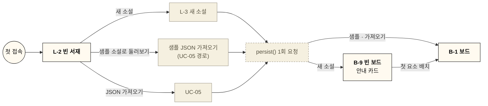

# 빈 상태 · 온보딩 (Empty States & Onboarding)

처음 쓰는 작가가 첫 소설을 만들고 첫 블록을 놓기까지의 흐름과, 데이터가 없을 때 각 화면이 보여 줄 내용. [유스케이스](./usecase.md) UC-01과 [와이어프레임](./wireframe.md)의 기준.

- **범위**: 데스크톱. 태블릿·모바일 문구·배치는 태블릿·모바일 와이어프레임에서 반영
- **방침**: 별도 투어·튜토리얼 화면 없음. **샘플 소설** + **빈 화면 안에서 다음 행동 안내**로 해결
- **프레임**: L-2 빈 서재 · B-9 빈 보드 · W-7 빈 사전 ([`wireframes/`](./wireframes/))

첫 실행 흐름

굵은 글씨 = 주 화면, 점선 = 앱이 자동으로 하는 일

## 1. 첫 실행 흐름 (UC-01)

1. 로컬 데이터 없음 → **L-2 빈 서재**: 새 소설 · 샘플 소설로 둘러보기 · JSON 가져오기
2. 셋 중 하나로 **첫 소설이 생기는 순간** `navigator.storage.persist()` 1회 요청 → 결과를 `AppMeta.persist`에 기록. 거부돼도 막지 않음 (백업 알림 UC-41이 기본 대책)
3. 새 소설 → **B-9 빈 보드**(안내 카드) / 샘플·가져오기 → 채워진 보드(B-1)
4. 보드에 첫 요소를 놓으면 안내 카드가 사라지고 이후 다시 나오지 않음 (요소를 모두 지우면 다시 표시)

## 2. 빈 상태 목록

| 화면 | 표시 조건 | 문구 (초안) | 행동 | 프레임 |
|---|---|---|---|---|
| 서재 | 소설 0개 | 아직 소설이 없어요 / 첫 소설을 만들고 시간축 위에 사건을 올려 보세요. 모든 내용은 이 브라우저에 자동 저장됩니다. | 새 소설 · JSON 가져오기 · 샘플 소설로 둘러보기 | L-2 |
| 서재 (예외) | IndexedDB 사용 불가 | 이 브라우저에서는 저장할 수 없습니다 | 배너 닫기 | L-2 |
| 보드 | 보드 요소 0개 | 시간축에 첫 사건을 올려 보세요 + 3단계 안내 | 도구 끌어 놓기 · `?` 단축키 도움말 | B-9 |
| 보드 | 요소는 있으나 필터로 전부 숨김 | 필터로 N개 숨김 | 필터 해제 | B-9 |
| 사전 | 분류에 문서 0개 | 아직 ○○ 문서가 없어요 + 보조 문구 (캐릭터·사건: "보드에 블록을 놓으면 자동으로 생겨요", 그 외: 템플릿 안내) | + 새 문서 · 보드로 가기(캐릭터·사건만) | W-7 |
| 사전 | 사전 탭 첫 진입, 연 문서 없음 | 첫 분류(캐릭터)의 분류 화면을 표시 → 문서 0개면 위 빈 상태 | — | W-7 |
| 사전 표 보기 | 분류에 문서 0개 | 표 대신 위 빈 상태 | + 새 문서 | W-7 |
| 사전 검색 | 결과 0건 | '검색어'와 일치하는 문서가 없어요 / 제목·별칭·본문에서 찾았어요 | + '검색어' 문서 만들기 · 검색 지우기 | W-7 |
| 빠른 이동 | 결과 0건 | 일치하는 문서·시점이 없어요 | 숫자 입력 시 눈금 번호 이동 안내 | W-7 |
| 문서 하단 | 역링크 0 · 보드 연동 0 | 이 문서를 언급한 문서가 없어요 / 보드에 아직 없어요 | (캐릭터·사건) 보드로 끌어 배치 안내 | W-7 |
| 필터 메뉴 | 캐릭터·태그 0개, 라인 0개 | 항목 대신 "캐릭터 없음" · "태그 없음" · "라인 없음 — 라인 편집" | 라인 편집(B-6) | — (B-5 문구만) |

- 빈 상태 공통 형태: 짧은 제목 1줄 + 보조 문구 1~2줄 + 버튼 최대 2개. 일러스트는 서재 빈 상태에만
- 문구는 초안. 구현 시 ui_guide 한글 타이포 규칙(`break-keep`) 적용

## 3. 보드 안내 카드 (B-9)

- **표시 조건**: 보드 요소(`BoardItem`) 실제 개수 0 (필터와 무관). 저장하는 상태 없음 → **데이터 모델 변경 없음**
- **위치**: 시간축 위쪽, 0 눈금 오른쪽 빈 공간. 화면에 고정된 UI(줌·팬에 따라 움직이지 않음), 포인터 이벤트는 카드 영역만 받음 → 카드 밖 캔버스는 평소처럼 배치·팬 가능
- **내용**
  1. **사건 올리기** — 도구 모음 "사건"(`E`)을 시간축 위로 끌어 놓기. 놓은 자리 눈금에 스냅
  2. **캐릭터 기록** — "캐릭터 상태"(`C`)를 축 아래에 놓고 등장·변화·퇴장 기록
  3. **설정 정리** — 사전 탭(`Alt+2`)에서 캐릭터·장소·세계관 문서 작성. 블록과 문서는 자동 연결
  - 하단: "단축키 보기 `?`" · "시점을 모르면 왼쪽 '시점 미정'에 놓으세요"
- **숨김**: 첫 요소 배치(끌어 놓기·붙여넣기·사전 문서 끌기 포함) 즉시. 닫기 버튼 없음
- **도구 강조**: 안내 카드가 보이는 동안 도구 모음의 사건·캐릭터 상태 버튼에 약한 강조 테두리
- **시간축 초기 화면**: 0 눈금이 화면 가로 중앙 근처, 눈금 라벨 없음(숫자만), 미정 영역은 빈 점선 상자

## 4. 샘플 소설

| 항목 | 내용 |
|---|---|
| 파일 | `public/samples/sample.whitenoard.json` — 형식은 `NovelExport` 그대로 ([data_model.md](./data_model.md) 7장) |
| 진입 | L-2 빈 서재의 "샘플 소설로 둘러보기" 카드 (소설이 1개 이상이면 숨김) |
| 동작 | `fetch` → UC-05 가져오기 함수 그대로 호출(형식 확인 · `schemaVersion` 변환 · ID 재발급) → 새 소설로 추가 → 보드로 이동 |
| 성격 | 일반 소설과 동일 (편집 · 복제 · 내보내기 · 삭제 자유, 백업 알림 대상). 제목에 "(샘플)" 표기 |
| 이미지 | 없음 (앱 번들 용량, 표지는 제목 기본 표지) |
| 로딩 | 버튼에 진행 표시, 실패 시 가져오기 오류(L-5)와 같은 대화상자 |

**내용 구성** (짧은 판타지 1편, 제목 예: "잿빛 왕관 (샘플)")
- 보드: MVP 보드 요소 종류를 각각 1개 이상
  - 눈금 라벨 몇 개 · 접힌 구간 1개 · 미정 영역 사건 1개
  - 사건 6~8개: 메인 · 서브 · 사이드 라인 각각, 기간 사건 1개, 라인 미지정 1개
  - 캐릭터 3명: 상태 블록 등장 · 변화(속성 변경) · 퇴장
  - 포스트잇 · 자유 텍스트 · 프레임("1부") 각 1개, 연결선 2개(실선 원인→결과, 점선 복선→회수)
- 사전: 기본 분류 6개 중 4개 이상에 문서, 본문 `@` 링크(→ 역링크 확인), 캐릭터 템플릿 속성 채움
- 포스트잇 1개에 "이 소설은 샘플입니다. 마음껏 고치고 지워 보세요" 안내

**유지 규칙**
- 샘플 JSON의 `schemaVersion`은 작성 당시 값 유지 → 앱이 올라가면 가져오기 변환 경로로 자동 처리
- Vitest: 샘플 파일을 가져오기 함수에 넣어 오류 없이 새 소설이 생기는지 확인 (변환 경로 회귀 방지)

## 5. 기본값으로 정한 사항 (변경 가능)
- **샘플 노출 위치**: 빈 서재에서만. 샘플을 지운 뒤 다시 보려면 소설을 모두 비우거나, 추후 `?` 도움말에 링크 추가 검토
- **안내 카드**: 닫기 버튼·"다시 보지 않기" 없음. 요소 0개일 때만 자동 표시
- **`persist()` 요청 시점**: 앱 첫 실행 → **첫 소설이 생기는 순간** (새 소설 · 샘플 · 가져오기). 사용자 동작 직후라 권한 창(Firefox 등)이 덜 갑작스러움
- **사전 첫 진입**: 연 문서가 없으면 첫 분류(캐릭터)의 분류 화면
- **문구**: 2장 표는 초안, 구현 시 다듬기
