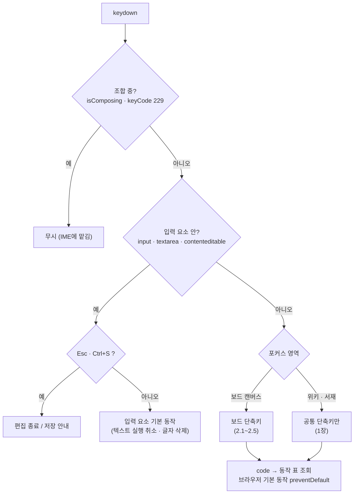

# 단축키 (Shortcuts)

MVP(F0·F1·F4) 키보드·마우스 조작 목록. [usecase.md](./usecase.md)의 흐름을 키보드로 수행할 수 있는지 대조하고, [spikes.md](./spikes.md) C2에서 확정한 IME 규칙을 구현 기준으로 정리.

- **표기**: Windows 기준. macOS는 `Ctrl` → `⌘`, `Alt` → `⌥` (`Ctrl+클릭` 등 마우스 조합 포함)
- **키 판정**: 모든 단축키는 `KeyboardEvent.code` 기준 (`KeyV`, `Digit1` …) → 한글 입력 모드에서도 같은 키로 동작 (C2)
- **대상 기기**: 키보드가 있는 데스크톱·태블릿. 모바일은 키보드 단축키 없음 (A8)

아래는 키 입력 1건이 처리되는 순서 (3장 규칙)

조합 중·입력 요소 안에서는 보드 동작이 절대 실행되지 않음 (C2 합격 기준)

## 1. 공통 (모든 화면)

| 키 | 동작 | 비고 |
|---|---|---|
| `Ctrl+K` | 빠른 이동: 위키 문서(제목·별칭)·눈금 라벨 검색 → 선택 시 문서 열기 / 보드 해당 시점으로 이동 | UC-21 "특정 시점으로 이동", UC-34 검색 |
| `Shift+/` (`?`) | 단축키 도움말 열기 | 이 문서의 표를 앱 안에 표시 |
| `Ctrl+S` | 저장 대화상자 대신 "자동 저장됨" 알림 | 습관적 입력 대응, 브라우저 저장 막음 (UC-40) |
| `Esc` | 한 단계 닫기 (1.1 순서) | |
| `Alt+1` / `Alt+2` | 작업공간 탭 전환: 보드 / 위키 | 소설 작업공간에서만 |

### 1.1 `Esc` 처리 순서
열려 있는 것 중 **가장 위 1개만** 닫음
1. `@` 멘션 후보 목록
2. 텍스트 편집 (블록·포스트잇 인라인 편집 종료, 내용 유지 — C6)
3. 컨텍스트 메뉴·대화상자·빠른 이동
4. 배치 도구 → 선택 도구(`V`)로 복귀
5. 선택 해제
6. 위키 패널 (태블릿 오버레이)

## 2. 보드

포커스가 보드 캔버스에 있고 텍스트 편집 중이 아닐 때만 동작.

### 2.1 도구

| 키 | 도구 | 비고 |
|---|---|---|
| `V` | 선택 | 기본 도구 |
| `H` | 손 (팬) | 빈 곳 드래그 = 화면 이동 |
| `E` | 사건 블록 | UC-10 |
| `C` | 캐릭터 상태 블록 | 다시 누르면 등장 → 변화 → 퇴장 순환 (UC-12) |
| `S` | 포스트잇 | UC-17 |
| `T` | 텍스트 | UC-17 |
| `F` | 프레임 | 드래그로 영역 그리기 (UC-18) |
| `L` | 연결선 | 요소 → 요소로 끌기 (UC-19). 가장자리 핸들로도 생성 가능 |

- 배치 도구(`E`·`C`·`S`·`T`·`F`·`L`)는 **1회 배치 후 선택 도구로 복귀**
- 도구 모음 버튼 툴팁에 키 표시 (예: "사건 (E)")
- 예약 (MVP 이후, 도형 도구 도입 시): `R` 사각형 · `O` 원

### 2.2 선택 · 편집

| 키 | 동작 | 비고 |
|---|---|---|
| 클릭 / `Shift+클릭` · `Ctrl+클릭` | 선택 / 선택 추가·해제 | UC-20 |
| 빈 곳 드래그 (선택 도구) | 드래그 박스 선택 | `Shift`를 누르면 기존 선택에 추가 |
| `Ctrl+A` | 보드 전체 선택 | 페이지 글자 선택 대신 |
| `Tab` / `Shift+Tab` | 다음 / 이전 요소 선택 (화면 위치 순: 왼쪽 → 오른쪽, 위 → 아래) | 키보드 접근성 (features_spec 6장) |
| `Enter` | 선택 요소 열기: 사건·상태 블록 → 위키 패널에 문서 / 포스트잇·텍스트 → 편집 / 연결선 → 라벨 편집 | UC-22 |
| `F2` · 더블클릭 | 인라인 편집 (블록 제목, 포스트잇·텍스트 내용, 프레임 제목, 연결선 라벨) | |
| `Delete` · `Backspace` | 선택 요소 삭제 (확인 없음, 실행 취소 가능) | 프레임은 자식 유지 (C7) |
| `Ctrl+C` / `Ctrl+X` / `Ctrl+V` | 복사 / 잘라내기 / 붙여넣기 | 붙여넣기 위치 = 마우스 위치, 없으면 원본 +24px |
| `Ctrl+D` | 복제 (원본 +24px) | 사건 블록은 사건 문서도 복제 (UC-20) |
| `Ctrl+Z` | 실행 취소 | 드래그 1회·편집 1회 = 1건 (C2) |
| `Ctrl+Shift+Z` · `Ctrl+Y` | 다시 실행 | |
| `Ctrl+G` | 선택 요소를 감싸는 프레임 만들기 | 프레임은 선택에서 제외 (중첩 금지, C7) |
| `Ctrl+Shift+G` | 선택 프레임 풀기 (자식은 그 자리에 유지) | |

### 2.3 이동

| 키 | 사건·상태 블록 (시간축) | 그 외 요소 · 미정 영역 블록 |
|---|---|---|
| `←` `→` | 1 눈금 | 8px |
| `↑` `↓` | 8px | 8px |
| `Shift` + 방향키 | 가로 5 눈금 / 세로 40px | 40px |
| `Alt` 누른 채 드래그 | 눈금 스냅 일시 해제 | — |

- 방향키 이동 1회 = 실행 취소 1건 (연속으로 누르는 동안은 키를 뗄 때까지 1건으로 묶음)
- 방향키로는 시간축 ↔ 미정 영역을 넘나들지 않음 (0 눈금에서 멈춤). 미정 영역으로는 끌어서 이동 (UC-16)
- 캐릭터별 정렬(레인) 켜짐 상태에선 상태 블록 `↑` `↓` 무시 (UC-13)

### 2.4 화면 (줌 · 팬)

| 키 · 조작 | 동작 | 비고 |
|---|---|---|
| 마우스 휠 · 트랙패드 핀치 | 줌 (마우스 위치 기준) | features_spec F1 |
| `Space` + 드래그 · 가운데 버튼 드래그 | 팬 | 선택 도구 그대로 유지 |
| `+` / `-` | 확대 / 축소 (화면 중앙 기준) | `Equal`·`Minus`·숫자패드 |
| `Shift+0` | 100% | |
| `Shift+1` | 화면 맞춤 (전체 요소) | |
| `Shift+2` | 선택 요소에 맞춤 | 선택 없으면 무시 |

### 2.5 사용하지 않는 조합
- 텍스트 편집 중: 2.1~2.4 전부 무시, `Esc`만 편집 종료 (C2·C6)
- 드래그 중: 도구 전환 키 무시 (드래그 종료 후 적용)

## 3. 위키

위키 화면과 보드 우측 위키 패널에 공통 적용.

### 3.1 본문 편집 (Tiptap 기본값 사용)

| 키 · 입력 | 동작 |
|---|---|
| `Ctrl+B` / `Ctrl+I` | 굵게 / 기울임 |
| `Ctrl+Alt+1`~`3` · 줄 앞 `# ` `## ` `### ` | 제목 H1~H3 |
| `Ctrl+Shift+8` · 줄 앞 `- ` | 글머리 목록 |
| `Ctrl+Shift+7` · 줄 앞 `1. ` | 번호 목록 |
| `Ctrl+Shift+B` · 줄 앞 `> ` | 인용 |
| `Ctrl+Z` / `Ctrl+Shift+Z` | 본문 실행 취소 / 다시 실행 (보드 기록과 별개) |

- 보드 실행 취소와 섞이지 않음: 위키 본문은 Tiptap 자체 기록, 보드 기록은 보드 캔버스 포커스에서만 (UC-20)

### 3.2 `@` 멘션 후보 (UC-33)

| 키 | 동작 |
|---|---|
| `@` + 글자 | 제목·별칭 부분 일치 후보 열기 |
| `↑` `↓` | 후보 이동 |
| `Enter` · `Tab` | 선택해 링크 삽입 |
| `Esc` | 후보 닫기 (입력한 글자 유지) |

- 조합 중 `Enter`는 한글 확정만, 후보 선택 안 함 (C1: `isComposing`이면 무시)

### 3.3 속성 표 · 표 보기

| 키 | 동작 |
|---|---|
| `Enter` | 셀 편집 시작 / 확정 후 아래 칸 |
| `Tab` / `Shift+Tab` | 오른쪽 / 왼쪽 칸 (속성 키 → 값 → 다음 행) |
| `Esc` | 셀 편집 취소 (이전 값 복원) |

## 4. 구현 규칙

- **단일 핸들러**: 보드 단축키는 `window` keydown 핸들러 1개 + `code → 동작` 표로 처리. 컴포넌트마다 따로 등록하지 않음
- **무시 조건** (모든 단축키 공통, C2 확정)
  - `event.isComposing` 또는 `keyCode === 229`
  - 대상이 `input`·`textarea`·`[contenteditable]` (예외: `Esc`, `Ctrl+S`)
  - `event.repeat`인 도구 전환 키 (방향키·`+`·`-`는 반복 허용)
- **React Flow 설정**: 기본 키 처리를 끄고 자체 핸들러 사용
  - `deleteKeyCode={null}` (프레임 삭제 자체 처리, C7), `selectionKeyCode="Shift"`, `multiSelectionKeyCode={["Shift", "Control", "Meta"]}`
  - `panActivationKeyCode="Space"`, `selectionOnDrag` + `panOnDrag={[1]}` (가운데 버튼)
  - 터치 입력은 한 손가락 빈 곳 드래그 = 팬 (C5, UC-21) → `pointerType === 'touch'`일 때 `selectionOnDrag` 끄기
- **브라우저 예약 키는 가로채지 않음**: `Ctrl+N`·`Ctrl+T`·`Ctrl+W`·`Ctrl+Tab`·`Ctrl+1`~`9`·`Ctrl+L`·`Ctrl+F`·`Ctrl+P`·`F5`·`F11`
- **테스트**: Playwright로 한글 모드 단축키(`key: 'ㅍ'`, `code: 'KeyV'`), 편집 중 `Delete`·`Ctrl+Z` 무시, `Esc` 순서 검증 (스파이크 C2 테스트 이식)

## 5. 유스케이스 대조

| 유스케이스 | 단축키 |
|---|---|
| UC-10 사건 배치 | `E` |
| UC-11 기간·시점 조절 | `←` `→` (1 눈금), `Alt` 드래그 (스냅 해제) |
| UC-12 캐릭터 상태 | `C` (반복 = 유형 순환) |
| UC-16 미정 영역 | 끌어서만 이동 (2.3) |
| UC-17 포스트잇·텍스트 | `S`·`T`, `F2`·`Enter` 편집, `Esc` 종료 |
| UC-18 프레임 | `F`, `Ctrl+G` / `Ctrl+Shift+G` |
| UC-19 연결선 | `L`, `Enter` 라벨 편집 |
| UC-20 선택·복사·실행 취소 | 2.2 전체 |
| UC-21 둘러보기 | 2.4, `Ctrl+K` 시점 이동 |
| UC-22 보드 ↔ 위키 | `Enter` 문서 열기, `Alt+1`·`Alt+2` |
| UC-23 스토리 라인 | 전용 키 없음 (블록 메뉴, `Enter` → 사건 문서의 라인 칸) |
| UC-31·33 문서 작성·링크 | 3.1·3.2 |
| UC-34 표·검색 | 3.3, `Ctrl+K` |
| UC-40 자동 저장 | `Ctrl+S` 안내 |
| UC-01~05 서재 | 전용 단축키 없음 (브라우저 기본 `Tab` 이동) |

## 6. 기본값으로 정한 사항 (변경 가능)
- 선택 도구에서 빈 곳 드래그 = **박스 선택**, 팬은 `Space`+드래그·가운데 버튼·`H` 도구·터치 한 손가락 (Figma·Miro 방식)
- 배치 도구는 1회 배치 후 선택 도구로 복귀 (연속 배치 잠금 없음)
- `Ctrl+K` 하나로 문서 검색과 시점 이동을 함께 처리
- `Ctrl+G` 선택 요소 → 프레임 묶기 추가 (UC-18 "묶기"의 키보드 경로)
- 연결선 도구 키 `L`, 캐릭터 상태 `C`
