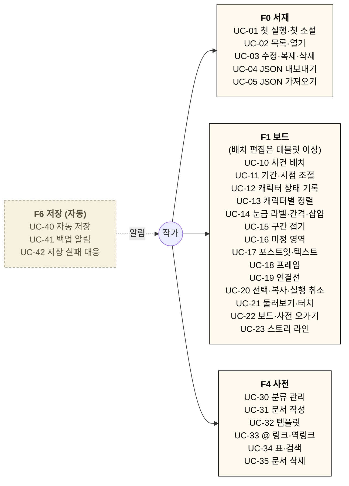
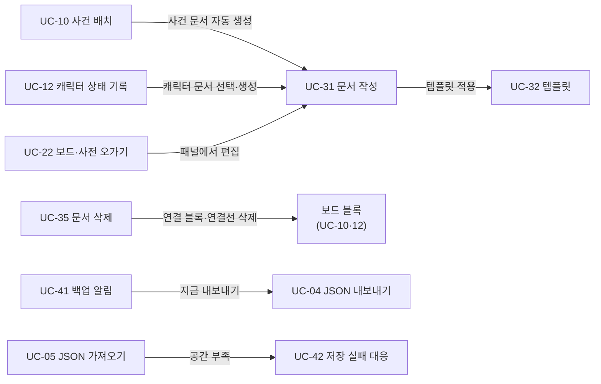

# 유스케이스 (Use Cases)

작가가 WhiteNoard로 하는 일을 흐름 단위로 정리. [데이터 모델](./data_model.md)·와이어프레임·[단축키](./shortcuts.md)가 이 흐름을 빠짐없이 지원하는지 대조하는 기준으로 사용.

- 기능 정의: [features_spec.md](./features_spec.md) / 검증 결과·구현 규칙: [spikes.md](./spikes.md)
- **액터**: 작가 1명 (로그인 없음, 1단계 로컬 저장)
- **기기**: 데스크톱(≥1024px) · 태블릿(768–1023px) · 모바일(<768px). 모바일은 보기 + 간단 편집만 (A8)
- **표기**: "관련 데이터"의 이름은 [data_model.md](./data_model.md)의 타입명

실선 = 작가가 직접 하는 일, 점선 = 앱이 먼저 알려 주는 일

유스케이스 사이의 포함·연쇄 동작

## 1. 목록

| ID | 이름 | 기능 | MVP | 기기 |
|---|---|---|---|---|
| UC-01 | 첫 실행 · 첫 소설 만들기 | F0·F6 | ✅ | 전체 |
| UC-02 | 소설 목록 보기 · 열기 | F0 | ✅ | 전체 |
| UC-03 | 소설 정보 수정 · 복제 · 삭제 | F0 | ✅ | 전체 |
| UC-04 | 소설 JSON 내보내기 (백업) | F0·F6 | ✅ | 전체 |
| UC-05 | 소설 JSON 가져오기 (복원·기기 이동) | F0·F6 | ✅ | 전체 |
| UC-10 | 사건 블록 배치 | F1 | ✅ | 태블릿 이상 |
| UC-11 | 사건 기간 · 시점 조절 | F1 | ✅ | 태블릿 이상 |
| UC-12 | 캐릭터 상태 블록 기록 (등장·변화·퇴장) | F1 | ✅ | 태블릿 이상 |
| UC-13 | 캐릭터별 정렬 (레인) | F1 | ✅ | 태블릿 이상 |
| UC-14 | 시간축 눈금 라벨 · 간격 · 삽입 | F1 | ✅ | 태블릿 이상 |
| UC-15 | 시간축 구간 접기 · 펼치기 | F1 | ✅ | 전체 (펼치기) / 태블릿 이상 (접기) |
| UC-16 | 미정 영역 배치 · 시점 부여 | F1 | ✅ | 태블릿 이상 |
| UC-17 | 포스트잇 · 텍스트 | F1 | ✅ | 태블릿 이상 (모바일은 내용 수정만) |
| UC-18 | 프레임으로 묶기 · 빼기 · 삭제 | F1 | ✅ | 태블릿 이상 |
| UC-19 | 연결선 (인과 · 복선) | F1 | ✅ | 태블릿 이상 |
| UC-20 | 다중 선택 · 복사 · 삭제 · 실행 취소 | F1 | ✅ | 태블릿 이상 |
| UC-21 | 보드 둘러보기 (줌·팬·미니맵·터치) | F1 | ✅ | 전체 |
| UC-22 | 보드 ↔ 사전 오가기 | F1·F4 | ✅ | 전체 (드래그 생성은 태블릿 이상) |
| UC-23 | 스토리 라인 지정 · 관리 (메인·서브·사이드) | F1·F4 | ✅ | 전체 (블록 메뉴 지정은 태블릿 이상) |
| UC-30 | 사전 분류 관리 | F4 | ✅ | 전체 (드래그 정렬은 태블릿 이상) |
| UC-31 | 사전 문서 작성 | F4 | ✅ | 전체 |
| UC-32 | 분류 템플릿 설정 | F4 | ✅ | 전체 |
| UC-33 | `@` 링크 · 역링크 | F4 | ✅ | 전체 |
| UC-34 | 표 보기 · 검색 | F4 | ✅ | 전체 |
| UC-35 | 사전 문서 삭제 | F4 | ✅ | 전체 |
| UC-40 | 자동 저장 | F6 | ✅ | 전체 |
| UC-41 | 백업 알림 (A9) | F6 | ✅ | 전체 |
| UC-42 | 저장 실패 · 공간 부족 대응 | F6 | ✅ | 전체 |
| UC-50 | 서술 순서 구성 | F2 | 이후 | — |
| UC-51 | 시점별 캐릭터 상태 조회 | F3 | 이후 | — |
| UC-52 | 메모 관리 · 변환 | F5 | 이후 | — |

## 2. F0 서재

### UC-01 첫 실행 · 첫 소설 만들기
- **사전조건**: 이 브라우저에서 처음 접속 (로컬 데이터 없음)
- **기본 흐름**
  1. 서재가 빈 상태로 열림 → 빈 상태 안내 + "새 소설" 버튼 (샘플 소설 제공 여부는 온보딩 설계에서 결정)
  2. 앱이 `navigator.storage.persist()`를 1회 요청, 결과 기록
  3. 작가가 "새 소설" → 제목 입력(필수), 장르·소개는 선택
  4. 소설 생성과 함께 보드 1개, 기본 사전 분류 6개(캐릭터 / 사건 / 장소 / 세력·조직 / 아이템 / 세계관 설정)와 기본 템플릿, 기본 스토리 라인 3개(메인 / 서브 / 사이드) 생성
  5. 소설 작업공간의 보드 화면으로 이동 (시간축 0 눈금이 화면 중앙 근처)
- **대안·예외**
  - `persist()` 거부(새 사이트에서 일반적, C8) → 막지 않음. 백업 알림(UC-41)을 기본 대책으로 사용
  - IndexedDB 사용 불가(시크릿 모드 일부 등) → 저장 불가 경고, 내보내기로만 보존 가능함을 안내
- **관련 데이터**: `Novel`, `Board`, `WikiCategory`(system), `AppMeta`(persist 결과)

### UC-02 소설 목록 보기 · 열기
- **기본 흐름**
  1. 서재에 소설 카드(표지·제목·장르·최근 수정일) 표시, 기본 정렬 = 최근 수정순
  2. 정렬을 제목순으로 바꿀 수 있음 (선택 유지)
  3. 카드 클릭 → 마지막으로 보던 탭(보드/사전)과 보드 화면 위치로 복귀
- **관련 데이터**: `Novel.updatedAt`·`title`, `UiState`(마지막 탭·뷰포트), `AppMeta`(서재 정렬)

### UC-03 소설 정보 수정 · 복제 · 삭제
- **기본 흐름**
  - 수정: 카드 메뉴 → 제목·장르·소개·표지 이미지 변경 (표지는 UC-31 이미지 규칙과 같게 리사이즈)
  - 복제: 소설 전체(보드·사전·이미지)를 새 ID로 복사, 제목 뒤 "(사본)"
  - 삭제: 확인 대화상자(소설 제목 표시) → 소설과 하위 데이터 모두 삭제
- **대안·예외**: 삭제 직후 되돌리기 알림(몇 초) 제공. 휴지통은 MVP 제외
- **관련 데이터**: `Novel`, 하위 전체 레코드, `ImageAsset`

### UC-04 소설 JSON 내보내기 (백업)
- **기본 흐름**
  1. 서재 카드 메뉴 또는 작업공간 메뉴 → "내보내기"
  2. 소설 1개와 하위 레코드·이미지를 담은 `.json` 파일 다운로드 (파일명: `소설제목_YYYYMMDD.whitenoard.json`)
  3. 마지막 백업 시각 기록 → 백업 알림(UC-41) 초기화
- **관련 데이터**: `NovelExport`, `Novel.lastExportedAt`

### UC-05 소설 JSON 가져오기
- **기본 흐름**
  1. 서재 → "가져오기" → 파일 선택
  2. `format`·`schemaVersion` 확인 → 이전 버전이면 단계별 변환
  3. **항상 새 소설로 추가** (모든 ID 재발급, 사전 본문 멘션의 문서 ID도 함께 변환) → 같은 파일을 두 번 가져와도 충돌 없음
  4. 서재에 새 카드 표시
- **대안·예외**
  - 형식이 아니거나 더 새로운 `schemaVersion` → 가져오지 않고 이유 표시 ("앱을 새로고침해 최신 버전으로 업데이트")
  - 용량 부족 → UC-42
- **관련 데이터**: `NovelExport`, 전체 레코드

## 3. F1 화이트보드 타임라인

### UC-10 사건 블록 배치
- **사전조건**: 보드 화면, 태블릿 이상
- **기본 흐름**
  1. 도구 모음의 "사건"을 캔버스로 끌어다 놓기(Pointer Events) 또는 도구 선택(단축키 `E`) 후 클릭
  2. 놓은 x 위치 → 가장 가까운 눈금으로 스냅(스냅 on 기본). 축 위쪽에 배치
  3. 사건 분류에 사전 문서 자동 생성, 블록 제목 입력 = 문서 제목
  4. 색상·태그·스토리 라인은 블록 메뉴에서 변경 (태그·라인은 사건 문서에 저장, 색은 블록에 저장). 새 사건의 라인은 미지정(UC-23)
- **대안·예외**
  - 시간축 왼쪽(미정 영역)에 놓음 → UC-16
  - 축 아래쪽에 놓아도 허용 (세로 위치는 자유, 위/아래는 권장 배치)
  - 모바일 → 도구 모음 숨김, 배치 불가 안내
- **관련 데이터**: `BoardItem`(kind `event`, `place.mode` `timed`), `WikiDoc`(사건 분류), `Board.timeScale`

### UC-11 사건 기간 · 시점 조절
- **기본 흐름**
  1. 블록을 좌우로 끌기 → 시점 변경 (눈금 스냅)
  2. 블록 양 끝 핸들 끌기 → 기간 사건(시작~끝 눈금), 끝을 시작과 같게 줄이면 단일 시점
- **대안·예외**: 스냅 off → 눈금 사이 위치 허용, 작중 시점은 가장 가까운 눈금으로 계산
- **관련 데이터**: `BoardItem.place.t`·`tEnd`

### UC-12 캐릭터 상태 블록 기록
- **기본 흐름**
  1. 도구 "캐릭터 상태"(등장·변화·퇴장 선택) → 축 아래쪽에 배치
  2. 캐릭터 선택: 기존 캐릭터 문서 검색(제목·별칭) 또는 새 캐릭터 이름 입력 → 캐릭터 문서 생성
  3. 유형별 입력
     - 등장: 초기 속성값 (템플릿 키 목록 제공)
     - 변화: 속성 변경 `키: 이전값 → 새값` 여러 줄. 이전값은 직전 시점까지 누적값으로 자동 채움(수정 가능)
     - 퇴장: 사유 메모 (예: `상태: 생존 → 사망`)
  4. 자유 메모 입력
  5. (선택) 관련 사건 블록 지정 → 두 블록 사이 옅은 연결 표시
- **대안·예외**: 같은 캐릭터에 퇴장 이후 블록 추가 → 경고만 표시(부활·재등장 허용)
- **관련 데이터**: `BoardItem`(kind `state`, `stateType`, `changes`, `linkedEventItemId`), `WikiDoc`(캐릭터 분류)

### UC-13 캐릭터별 정렬 (레인)
- **기본 흐름**
  1. "캐릭터별 정렬" 켜기 → 상태 블록이 캐릭터마다 가로 줄(레인)로 정렬, 레인 왼쪽에 캐릭터 이름
  2. 캐릭터별 첫 등장~퇴장 구간 강조 띠 표시
  3. 레인 순서 끌어서 변경
  4. 끄기 → 원래 세로 위치로 복귀
- **관련 데이터**: `Board.stateLanes`, `BoardItem.place.y`(수동 위치 보존)

### UC-14 시간축 눈금 라벨 · 간격 · 삽입
- **기본 흐름**
  - 라벨: 눈금 클릭 → 자유 텍스트("1년차 봄"), 비우면 숫자 표시
  - 간격: 보드 설정에서 눈금 간격(px) 조절 → 모든 시간 블록 위치 재계산(작중 시점 불변)
  - 삽입: 눈금 우클릭/길게 누르기 → "앞에 눈금 삽입" → 그 눈금 이상의 블록·라벨·접힌 구간이 1칸씩 뒤로
- **관련 데이터**: `Board.timeScale`(`pxPerTick`·`tickLabels`·`collapsed`), `BoardItem.place.t`

### UC-15 시간축 구간 접기 · 펼치기
- **기본 흐름**
  1. 축에서 구간(예: 12~40) 선택 → "접기" → ≈ 표시로 축소, 구간 안 블록은 압축 표시
  2. ≈ 표시 클릭 → 펼치기
- **관련 데이터**: `Board.timeScale.collapsed`·`collapsedPx`

### UC-16 미정 영역 배치 · 시점 부여
- **기본 흐름**
  1. 사건·상태 블록을 시간축 왼쪽 "시점 미정" 영역에 놓음 → 작중 시점 없음
  2. 나중에 시간축 위로 옮기면 눈금에 스냅되며 시점 부여 (반대로 옮기면 시점 해제)
- **관련 데이터**: `BoardItem.place.mode`(`undated` ↔ `timed`)

### UC-17 포스트잇 · 텍스트
- **기본 흐름**
  1. 도구 선택(`S` 포스트잇, `T` 텍스트) → 아무 곳에 배치, 색 선택(포스트잇)
  2. 더블클릭 → 바로 편집. 편집 중 드래그는 글자 선택, 휠은 텍스트 스크롤(C6)
  3. Esc·바깥 클릭 → 편집 종료. 편집 1회 = 실행 취소 1건(C2)
- **대안·예외**: 모바일은 기존 포스트잇 내용 수정만 가능
- **관련 데이터**: `BoardItem`(kind `sticky`·`text`, `place.mode` `free`, `text`, `style.color`)

### UC-18 프레임으로 묶기 · 빼기 · 삭제
- **기본 흐름**
  1. 도구 `F` → 영역 그려 프레임 생성, 좌상단 제목("1부")
  2. 요소를 프레임 안으로 끌기 → 요소 중심점이 들어간 프레임에 소속 (화면 위치 변화 없음)
  3. 프레임 이동 → 소속 요소 함께 이동 (사건·상태 블록은 작중 시점도 함께 이동)
  4. 프레임 삭제 → 소속 요소는 그 자리에 남음
- **대안·예외**: 프레임 안에 프레임 넣기 불가(중첩 금지, C7)
- **관련 데이터**: `BoardItem`(kind `frame`), `BoardItem.parentFrameId`, `z`

### UC-19 연결선
- **기본 흐름**
  1. 블록·포스트잇 가장자리 핸들에서 다른 요소로 끌기 → 화살표 생성
  2. 선 더블클릭 → 라벨("원인→결과", "복선→회수"), 실선/점선 선택
- **관련 데이터**: `BoardEdge`

### UC-20 다중 선택 · 복사 · 삭제 · 실행 취소
- **기본 흐름**
  - 선택: 드래그 박스, Shift+클릭
  - 복사·붙여넣기·복제(Ctrl+C/V/D): 새 ID로 복사, 사건 블록 복사 시 사건 문서도 복제(1:1 유지, 태그·스토리 라인 포함)
  - 삭제(Delete): 확인 없이 삭제 + 실행 취소 가능
  - 실행 취소·다시 실행(Ctrl+Z / Ctrl+Shift+Z): 보드 단위 기록, 드래그 1회·편집 1회 = 1건 (C2)
- **대안·예외**
  - 텍스트 편집 중 Delete·Ctrl+Z → 텍스트에만 적용, 보드 동작 없음 (C2)
  - 한글 입력 모드에서도 단축키는 `KeyboardEvent.code` 기준으로 동작
  - 사건 블록 삭제 → 사건 문서는 남음(사전에서 다시 보드로 끌어 배치 가능). 단, 블록과 함께 자동 생성된 뒤 내용이 비어 있는 문서는 함께 삭제
  - 실행 취소 기록은 새로고침·소설 전환 시 초기화
- **관련 데이터**: `BoardItem`, `BoardEdge`, `WikiDoc` (실행 취소 기록은 저장하지 않음)

### UC-21 보드 둘러보기
- **기본 흐름**
  - 휠·트랙패드 핀치 줌, 스페이스+드래그·가운데 버튼 드래그·`H` 도구로 팬(선택 도구의 빈 곳 드래그는 박스 선택), 미니맵, 화면 맞춤
  - "특정 시점으로 이동"(`Ctrl+K`): 눈금 번호·라벨 검색 → 해당 위치로 이동
  - 터치: 한 손가락 = 빈 곳 팬 / 블록 이동, 두 손가락 = 줌·팬, 길게 누르기 = 메뉴 (C5)
  - 멀리 축소(줌 0.5 미만) → 블록 간략 표시(제목만) (C3)
- **대안·예외**: 모바일에서 블록 드래그 이동은 막고 팬으로 처리 (A8)
- **관련 데이터**: `UiState.viewport`
- 전체 키 목록: [shortcuts.md](./shortcuts.md)

### UC-22 보드 ↔ 사전 오가기
- **기본 흐름**
  1. 사건·상태 블록의 상세 버튼 → 우측 사전 패널(태블릿: 오버레이, 모바일: 하단 시트)에 문서 열림
  2. 패널에서 문서 수정 → 블록 제목·태그 즉시 반영
  3. 사전 패널의 사건 문서를 보드로 끌기 → 사건 블록 생성(이미 보드에 있으면 그 블록으로 이동)
  4. 캐릭터 문서를 보드로 끌기 → 그 캐릭터의 "등장" 상태 블록 생성
- **관련 데이터**: `BoardItem.docId`, `WikiDoc`

### UC-23 스토리 라인 지정 · 관리
- **기본 흐름**
  - 지정: 사건 블록 메뉴 → "라인" → 메인 / 서브 / 사이드 / 추가한 라인 / 미지정 중 선택 (사건당 1개). 여러 블록을 선택했으면 한꺼번에 지정
  - 사전 사건 문서의 "라인" 선택 칸에서도 지정 (보드 블록이 없는 사건 문서도 가능)
  - 보드 표시: 블록 안 라인 배지 + 라인별 테두리 모양 (메인 굵은 실선 / 서브 실선 / 사이드 점선)
  - 필터: 보드 필터 메뉴에서 라인별 표시·숨김 ("미지정" 포함). 숨긴 사건의 연결선도 숨김
  - 관리: 필터 메뉴 → "라인 편집" → 추가·이름 변경·끌어서 순서 변경·삭제
- **대안·예외**
  - 사용 중인 라인 삭제 → "사건 N개가 미지정이 됩니다" 확인 후 삭제
  - 라인을 모두 삭제해도 됨 (배지·테두리 없이 표시)
  - 라인 색 지정은 MVP 이후 (MVP는 배지·테두리 모양으로만 구분)
- **관련 데이터**: `StoryLine`, `WikiDoc.lineId`, `UiState.filters.hiddenLineIds`

## 4. F4 사전

### UC-30 사전 분류 관리
- **기본 흐름**
  - 분류 트리에서 추가·이름 변경·하위 분류 만들기·끌어서 순서·위치 변경
  - 삭제: 비어 있는 분류만 삭제 가능 (문서가 있으면 옮기라고 안내)
- **대안·예외**: 캐릭터·사건 분류(`system`)는 삭제·이동 불가, 이름 변경만 가능
- **관련 데이터**: `WikiCategory`(`parentId`, `order`, `system`)

### UC-31 사전 문서 작성
- **기본 흐름**
  1. 분류에서 "새 문서" → 분류 템플릿 속성이 빈 값으로 채워짐
  2. 제목·별칭(여러 개)·속성(키-값, 추가·삭제·순서 변경)·태그·본문 편집
  3. 본문: 제목(H1~H3)·목록·굵게·인용 (한글 입력 C1 검증 완료)
  4. 대표 이미지 업로드 → 긴 변 1600px WebP로 변환 후 저장(진행 표시, C8)
- **대안·예외**
  - 같은 제목 문서 허용 (별칭·분류로 구분), 목록에 분류 표시
  - 이미지 변환 실패(지원하지 않는 형식) → 오류 표시, 문서 저장은 계속
- **관련 데이터**: `WikiDoc`, `ImageAsset`

### UC-32 분류 템플릿 설정
- **기본 흐름**: 분류 설정 → 기본 속성 키 목록 편집(예: 캐릭터 → 나이·성별·소속·능력)
- **대안·예외**: 템플릿 변경은 **새 문서에만** 적용, 기존 문서는 그대로
- **관련 데이터**: `WikiCategory.templateProps`

### UC-33 `@` 링크 · 역링크
- **기본 흐름**
  1. 본문에서 `@` + 글자 → 제목·별칭 부분 일치 후보 → Enter로 선택(조합 중 Enter는 확정만, C1)
  2. 문서 하단에 "이 문서를 언급한 문서"(역링크) 목록
  3. 캐릭터 문서에 등장 사건·상태 변화 이력, 사건 문서에 관련 캐릭터 자동 표시
- **대안·예외**: 링크 대상 문서가 삭제됨 → 깨진 링크로 표시(취소선 + 클릭 시 안내)
- **관련 데이터**: `WikiDoc.body`(mention 노드), `WikiDoc.mentions`(파생 색인), `BoardItem.docId`

### UC-34 표 보기 · 검색
- **기본 흐름**
  - 표: 분류 1개 선택 → 문서 = 행, 속성 키 = 열, 셀 바로 수정, 열 기준 정렬. 사건 계열 분류는 "라인" 열 추가(라인 순서로 정렬)
  - 검색: 제목·별칭·본문 부분 일치, 결과에 분류·일치 부분 표시
- **관련 데이터**: `WikiDoc.props`, `WikiDoc.plainText`(파생)

### UC-35 사전 문서 삭제
- **기본 흐름**
  1. 문서 메뉴 → 삭제
  2. 보드에 쓰인 문서면 경고: "보드 블록 N개가 함께 삭제됩니다" (사건 = 블록 1개, 캐릭터 = 상태 블록 전부)
  3. 확인 → 문서와 연결 블록·그 블록의 연결선 삭제, 이 문서를 가리키던 링크는 깨진 링크가 됨
- **관련 데이터**: `WikiDoc`, `BoardItem`, `BoardEdge`

## 5. F6 저장

### UC-40 자동 저장
- **기본 흐름**
  - 모든 변경은 짧은 디바운스 후 IndexedDB에 저장, 저장 버튼 없음
  - 상단에 저장 상태 표시(저장 중 / 저장됨)
  - 드래그 중에는 저장하지 않고 드래그 종료 시 1회 저장
- **대안·예외**: 탭을 닫기 직전 미저장 변경 → 즉시 저장 시도(`visibilitychange`/`pagehide`)
- **관련 데이터**: 전체 레코드의 `updatedAt`, `Novel.updatedAt`(하위 변경 시 갱신)

### UC-41 백업 알림 (A9)
- **기본 흐름**
  1. 소설을 연 뒤, 마지막 내보내기 이후 변경이 있고 7일이 지났으면 알림 표시 ("마지막 백업: N일 전")
  2. "지금 내보내기" → UC-04 / "나중에" → 3일간 숨김
- **대안·예외**: 한 번도 내보내지 않은 소설 → 생성 후 3일부터 알림
- **관련 데이터**: `Novel.lastExportedAt`, `UiState.backupSnoozedUntil`
- 기간(7일·3일)은 구현 시 조정 가능한 기본값

### UC-42 저장 실패 · 공간 부족 대응
- **기본 흐름**
  1. 저장 실패(`QuotaExceededError` 등) → 저장 상태를 "저장 실패"로 표시, 다시 시도
  2. 공간 부족이면 사용량(`navigator.storage.estimate()`) 표시 + 내보내기 권장 + 이미지 많은 소설 안내
- **관련 데이터**: `ImageAsset`(용량 대부분)

## 6. MVP 이후 (요약)

| ID | 요약 |
|---|---|
| UC-50 서술 순서 구성 (F2) | 회차 목록에 사건 문서를 끌어 배치, 사건 1개를 여러 회차에 배치, 서술 방식(정상·회상·예고·복선·회수) 표시, 보드 비교 오버레이 |
| UC-51 시점별 캐릭터 상태 조회 (F3) | 눈금 선택 → 캐릭터 문서 속성 + 그 시점까지 상태 블록 변경 누적 = 상태 요약. 미정 영역 블록 제외 |
| UC-52 메모 관리 · 변환 (F5) | 소설별 메모 목록·핀 고정, 포스트잇 ↔ 메모, 메모 → 사전 문서 |
