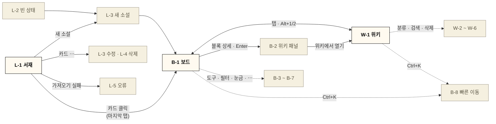

# 와이어프레임 (Wireframes)

MVP 화면(서재 · 보드 · 위키)의 구조와 배치. [유스케이스](./usecase.md)의 흐름이 화면에서 빠짐없이 지원되는지 대조하는 기준으로 사용.

- **범위**: 데스크톱(1440 × 900 기준)만. 태블릿·모바일은 이후 작성
- **충실도**: 로파이 회색조 — 구조·배치·라벨만. 색·폰트·라운드는 [ui_guide.md](./ui_guide.md), 키는 [shortcuts.md](./shortcuts.md)
- **파일**: [`wireframes/`](./wireframes/) 폴더의 HTML. 브라우저로 `wireframes/index.html`을 열어 확인 (GitHub에서는 소스로만 보임)
- **표기**: 각 프레임 아래 번호 주석 = 동작 · 관련 UC · 컴포넌트 이름(ui_guide)

화면 이동 흐름

굵은 글씨 = 주 화면, 연한 상자 = 대화상자·상태·보조 화면

## 1. 공통 구조

| 영역 | 구성 |
|---|---|
| 서재 헤더 | 서비스명 · 가져오기 · **새 소설** |
| 작업공간 상단 바 (보드·위키 공통) | ← 서재 · 소설 제목 · 탭(보드/위키) · 저장 상태(저장 중/저장됨/저장 실패) · 빠른 이동 검색칸(`Ctrl+K`) · `?` 단축키 도움말 · ⋯ 메뉴(내보내기 · 보드 설정 · 소설 정보) |
| 보드 | 전체 화면 캔버스 + 상단 중앙 도구 모음 + 우하단 줌·미니맵 + (열면) 우측 위키 패널 |
| 위키 | 최대 1280px 중앙: 좌측 분류 트리 240px + 우측 문서 영역 |

## 2. 서재 — [library.html](./wireframes/library.html)

| ID | 프레임 | 내용 | UC |
|---|---|---|---|
| L-1 | 소설 목록 | `novel-card` 4열 그리드, 정렬 탭(최근 수정순/제목순), 카드 ⋯ 메뉴(정보 수정·복제·내보내기·삭제), 표지 없는 소설 기본 표지 | 02 · 03 · 04 · 05 |
| L-2 | 빈 상태 | 새 소설 · 가져오기, IndexedDB 사용 불가 경고 배너(예외), 샘플 소설 자리표시 | 01 |
| L-3 | 새 소설 / 정보 수정 | 제목(필수) · 장르 · 소개 · 표지 업로드(WebP 변환 진행) | 01 · 03 |
| L-4 | 삭제 확인 + 되돌리기 | 제목 표시 확인창(내보내기 보조 버튼), 삭제 후 되돌리기 알림 | 03 |
| L-5 | 가져오기 오류 / 공간 부족 | `schemaVersion` 불일치 안내, 사용량 막대 + 이미지 많은 소설 내보내기 | 05 · 42 |

## 3. 보드 — [board.html](./wireframes/board.html)

| ID | 프레임 | 내용 | UC |
|---|---|---|---|
| B-1 | 기본 보드 | 도구 모음(V H │ E C S T F L │ 캐릭터별 정렬 · 스냅 · 필터), 미정 영역, 시간축(라벨 눈금 · 접힌 구간 칩), 사건 블록(라인 테두리 3종 + 배지, 기간 사건), 상태 블록(등장·변화·퇴장), 포스트잇 · 텍스트 · 프레임 · 연결선, 도구 끌어 놓기 + 스냅 가이드, 줌 · 미니맵, 백업 알림 배너 | 10 · 11 · 12 · 14 · 15 · 16 · 17 · 18 · 19 · 21 · 40 · 41 |
| B-2 | 블록 선택 · 블록 메뉴 · 위키 패널 | 선택 강조 + 리사이즈 핸들, 블록 메뉴(색 · 태그 · 라인 · 상세 · 복제 · 삭제) + 라인 하위 메뉴, 우측 위키 패널(라인 · 시점 · 태그 · 관련 캐릭터 · 속성 · 본문), 패널 문서 → 보드 끌기, 박스 선택 | 10 · 11 · 20 · 22 · 23 · 40 |
| B-3 | 상태 블록 입력 | ① 캐릭터 검색·새로 만들기 → ② 유형 탭 · 속성 변경 행(이전값 자동) · 메모 · 관련 사건, 퇴장 이후 경고 | 12 |
| B-4 | 캐릭터별 정렬 | 레인 머리(고정 · 끌어서 순서), 교차 배경, 등장~퇴장 빗금 띠, 미정 영역 블록도 레인 정렬 | 13 |
| B-5 | 필터 메뉴 | 라인(개수) · 캐릭터 · 태그 · 분류 체크, 라인 편집 진입, 숨김 개수 배지 | 23 |
| B-6 | 스토리 라인 편집 | 순서 끌기(테두리 모양이 순서를 따름) · 이름 · 사건 수 · 삭제 확인 | 23 |
| B-7 | 눈금 편집 · 구간 접기 · 보드 설정 · 저장 실패 | 라벨 인라인 입력, 눈금 우클릭 메뉴(앞에 삽입 · 라벨 · 구간 선택), 구간 접기 버튼, ⋯ 메뉴 + 보드 설정(눈금 간격 · 스냅 · 간략 표시), 저장 실패 안내 | 04 · 14 · 15 · 21 · 42 |
| B-8 | 빠른 이동 | 위키 문서 · 시간축 시점 두 그룹 결과, 접힌 구간이면 펼치고 이동 | 21 · 34 |

## 4. 위키 — [wiki.html](./wireframes/wiki.html)

| ID | 프레임 | 내용 | UC |
|---|---|---|---|
| W-1 | 캐릭터 문서 | 트리(검색 · 새 문서 · 분류 추가 · 하위 분류), 제목 · 별칭 · 태그, 속성 표 + 대표 이미지, 본문(링크 칩 · 깨진 링크), 보드 연동(등장 사건 · 상태 변화 이력), 역링크, "보드에서 보기 · N" | 22 · 30 · 31 · 33 |
| W-2 | 사건 문서 + `@` 멘션 | 라인 선택 칸 · 작중 시점(읽기 전용) · 관련 캐릭터(자동), `@카` 후보 목록 | 23 · 31 · 33 |
| W-3 | 표 보기 | 분류 화면 탭(문서 목록/표/설정), 첫 열 고정, 라인 열 + 라인 순서 정렬, 셀 바로 수정 | 23 · 34 |
| W-4 | 검색 결과 | 트리 위 검색칸, 분류별 결과 수 탭, 일치 위치 + 강조 문맥 | 34 |
| W-5 | 분류 설정 · 템플릿 · 트리 편집 | 분류 끌어 하위로 이동, 분류 메뉴(삭제 비활성 이유), 🔒 system 분류, 템플릿 키 목록 + "새 문서에만 적용" | 30 · 32 |
| W-6 | 문서 삭제 경고 | 함께 삭제될 블록·연결선 수, 깨진 링크 안내 | 35 |

## 5. 유스케이스 대조

MVP 유스케이스 전부가 최소 1개 프레임에 대응.

| UC | 프레임 | UC | 프레임 |
|---|---|---|---|
| UC-01 첫 실행 · 첫 소설 | L-2 · L-3 | UC-19 연결선 | B-1 |
| UC-02 목록 · 열기 | L-1 | UC-20 선택 · 복사 · 실행 취소 | B-2 |
| UC-03 수정 · 복제 · 삭제 | L-1 · L-3 · L-4 | UC-21 둘러보기 | B-1 · B-7 · B-8 |
| UC-04 JSON 내보내기 | L-1 · L-4 · B-7 | UC-22 보드 ↔ 위키 | B-2 · W-1 |
| UC-05 JSON 가져오기 | L-1 · L-5 | UC-23 스토리 라인 | B-2 · B-5 · B-6 · W-2 · W-3 |
| UC-10 사건 배치 | B-1 · B-2 | UC-30 분류 관리 | W-1 · W-5 |
| UC-11 기간 · 시점 조절 | B-1 · B-2 | UC-31 문서 작성 | W-1 · W-2 |
| UC-12 캐릭터 상태 기록 | B-1 · B-3 | UC-32 템플릿 | W-5 |
| UC-13 캐릭터별 정렬 | B-4 | UC-33 `@` 링크 · 역링크 | W-1 · W-2 |
| UC-14 눈금 라벨 · 간격 · 삽입 | B-1 · B-7 | UC-34 표 · 검색 | W-3 · W-4 · B-8 |
| UC-15 구간 접기 | B-1 · B-7 | UC-35 문서 삭제 | W-6 |
| UC-16 미정 영역 | B-1 · B-4 | UC-40 자동 저장 | B-1 · B-2 (저장 상태) |
| UC-17 포스트잇 · 텍스트 | B-1 | UC-41 백업 알림 | B-1 |
| UC-18 프레임 | B-1 | UC-42 저장 실패 · 공간 부족 | L-5 · B-7 |

## 6. 기본값으로 정한 사항 (변경 가능)
- **블록 메뉴**: 블록 선택 시 블록 위에 뜨는 가로 바. 우클릭 메뉴도 같은 항목
- **위키 패널**: 폭 약 400px, 오버레이가 아니라 캔버스를 밀어냄. 상세 버튼 또는 `Enter`로 열림 (더블클릭은 인라인 편집)
- **상태 블록 입력**: 놓은 직후 캐릭터 선택 → 유형별 입력 팝오버. 입력은 자동 저장, "완료"는 닫기만
- **레인 모드**: 상태 블록 지시선 생략 (레인과 겹침), 레인 머리는 화면 왼쪽 고정
- **백업 알림**: 상단 바 아래 가로 배너 (보드·위키 공통)
- **저장 실패**: 상단 바 저장 상태를 눌러 다시 시도 · 내보내기, 공간 부족이면 L-5 대화상자
- **보드 설정**: ⋯ 메뉴 → 팝오버 (눈금 간격 · 스냅 · 축소 시 간략 표시)
- **위키 분류 화면**: 트리에서 분류 이름 클릭 → 탭 3개(문서 목록 · 표 · 설정). 표 보기·템플릿 설정의 진입점
- **위키 검색**: 트리 위 검색칸 → 결과는 문서 영역. `Ctrl+K`는 문서 + 시점 빠른 이동
- **문서 → 보드**: 문서 상단 "보드에서 보기 · N" (연결 블록 수)

## 7. 남은 일
- 태블릿(768–1023px) · 모바일(<768px) 와이어프레임 — 도구 모음 축소, 위키 패널 오버레이/하단 시트, 모바일 편집 제한 (A8)
- 빈 상태 · 온보딩 확정 후 L-2 갱신 (샘플 소설 제공 여부)
- 단축키 도움말(`?`) 화면은 [shortcuts.md](./shortcuts.md) 표를 그대로 표시하는 대화상자로 가정, 별도 프레임 없음
